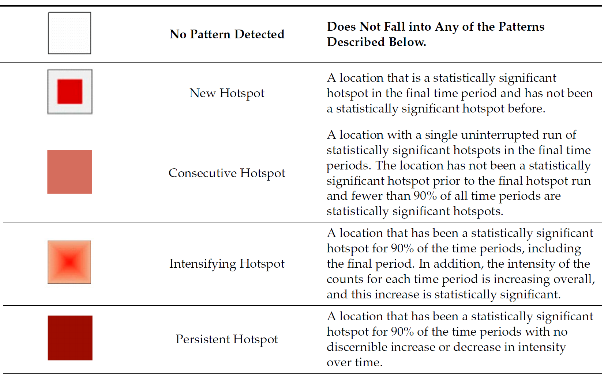

# Getting started

```{r}
pacman::p_load(sf, sfdep, tmap, plotly, tidyverse, Kendall)
```

## Importing geospatial data

```{r}
hunan <- st_read(
  dsn = "data/geospatial", 
  layer = "Hunan",
  quiet = TRUE) %>% 
  st_transform(crs = 32650)
```

::: {.callout-note collapse="false" title="How to check that the projection is in metres"}
EPSG:32650 is WGS 84 / UTM zone 50N, a projected coordinate system.

| Check | `hunan` after `st_transform()` | Before, EPSG:4326 |
|------------------------|------------------------|------------------------|
| `st_crs(hunan)$units_gdal` | `"metre"` | `"degree"` |

- Coordinates in the **hundreds of thousands or millions** are **metres**. Coordinates below 180 are degrees.
:::

## Importing attribute table

```{r}
GDPPC <- read_csv(
  "data/aspatial/Hunan_GDPPC.csv")
```

# Creating a time series cube

```{r}
GDPPC_st <- spacetime(GDPPC, hunan,
                      .loc_col = "County",
                      .time_col = "Year")
```

::: {.callout-note collapse="false" title="The four inputs of spacetime()"}
| Argument | Value | Description |
|------------------|------------------|------------------------------------|
| `.data` | `GDPPC` | the attribute table: one row per county per year |
| `.geometry` | `hunan` | the county polygons, the coordinates of each location |
| `.loc_col` | `"County"` | the location identifier, present in both tables, that links each row of `GDPPC` to a polygon in `hunan` |
| `.time_col` | `"Year"` | the time column, 2005 to 2021 |

- Every spatial data set needs a location identifier. Here it is the county name, and the 88 names in `GDPPC` and `hunan` match exactly.
- The time interval must be the same for every location.
:::

```{r}
is_spacetime_cube(GDPPC_st)
```

## Visualising the space-time cube

::: panel-tabset
#### The plot

```{r}
#| echo: false
#| fig-width: 6.5
#| fig-height: 10
years <- sort(unique(GDPPC$Year))
hunan_flat <- st_geometry(hunan) |> st_set_crs(NA)
tilt <- matrix(c(1, 0.5, 0, 0.3), 2, 2)
layer_gap <- 120000

cube <- map(seq_along(years), \(i) {
  st_sf(County = hunan$County, Year = years[i],
        geometry = hunan_flat * tilt + c(0, (i - 1) * layer_gap))
}) |>
  bind_rows() |>
  left_join(GDPPC, by = c("County", "Year"))

year_labels <- tibble(
  Year = years,
  x = st_bbox(cube)[["xmax"]] + 30000,
  y = mean(st_bbox(hunan_flat * tilt)[c("ymin", "ymax")]) +
    (seq_along(years) - 1) * layer_gap)

ggplot(cube) +
  geom_sf(aes(fill = GDPPC), colour = "white", linewidth = 0.05) +
  geom_text(data = year_labels, aes(x, y, label = Year),
            hjust = 0, size = 3) +
  scale_fill_viridis_c(trans = "log10", labels = scales::comma,
                       name = "GDPPC (log scale)") +
  labs(title = "GDPPC space-time cube: 88 counties × 17 years",
       subtitle = "Each layer is one year; every county appears once in every layer") +
  coord_sf(clip = "off") +
  theme_void() +
  theme(legend.position = "bottom",
        plot.margin = margin(5, 40, 5, 5))
```

#### The code

```{r}
#| eval: false
years <- sort(unique(GDPPC$Year))
hunan_flat <- st_geometry(hunan) |> st_set_crs(NA)
tilt <- matrix(c(1, 0.5, 0, 0.3), 2, 2)
layer_gap <- 120000

cube <- map(seq_along(years), \(i) {
  st_sf(County = hunan$County, Year = years[i],
        geometry = hunan_flat * tilt + c(0, (i - 1) * layer_gap))
}) |>
  bind_rows() |>
  left_join(GDPPC, by = c("County", "Year"))

year_labels <- tibble(
  Year = years,
  x = st_bbox(cube)[["xmax"]] + 30000,
  y = mean(st_bbox(hunan_flat * tilt)[c("ymin", "ymax")]) +
    (seq_along(years) - 1) * layer_gap)

ggplot(cube) +
  geom_sf(aes(fill = GDPPC), colour = "white", linewidth = 0.05) +
  geom_text(data = year_labels, aes(x, y, label = Year),
            hjust = 0, size = 3) +
  scale_fill_viridis_c(trans = "log10", labels = scales::comma,
                       name = "GDPPC (log scale)") +
  labs(title = "GDPPC space-time cube: 88 counties × 17 years",
       subtitle = "Each layer is one year; every county appears once in every layer") +
  coord_sf(clip = "off") +
  theme_void() +
  theme(legend.position = "bottom",
        plot.margin = margin(5, 40, 5, 5))
```
:::

# Computing Gi\*

## Deriving the spatial weights

```{r}
GDPPC_nb <- GDPPC_st %>%
  activate("geometry") %>%
  mutate(nb = include_self(
    st_contiguity(geometry)),
    wt = st_inverse_distance(nb, 
                             geometry, 
                             scale = 1,
                             alpha = 1),
    .before = 1) %>%
  set_nbs("nb") %>%
  set_wts("wt")
```

::: {.callout-note collapse="false" title="Why activate() comes first, and why include_self()"}
`GDPPC_st` holds two linked tables. The link is a dynamic join on `County`: no merged 1,496-row table with geometry is built.

| Context | Rows | Holds |
|-----------------------|------------------|-------------------------------|
| `"data"` (active after `spacetime()`) | 1,496 | one row per county per year: `Year`, `County`, `GDPPC` |
| `"geometry"` | 88 | one polygon per county |

- `activate("geometry")` switches to the 88 polygons, so the neighbours and weights are calculated once per county from the geometry layer only. Without it, `mutate()` runs on the data context, which has no geometry, and fails with `object 'geometry' not found`. Always activate the geometry before calculating on it. `activate()` is from **sfdep**.
- `st_contiguity()` gives the neighbour list `nb`, as in Hands-on Ex 5.
- `st_inverse_distance(nb, geometry, scale = 1, alpha = 1)` gives each neighbour the weight 1 / (distance / scale)\^alpha, so nearer neighbours count more. `scale = 1` and `alpha = 1` leave the distance unchanged (the default `scale` is 100).
- `.before = 1` puts the new `nb` and `wt` columns in front of the existing columns.
- `set_nbs("nb")` and `set_wts("wt")` copy `nb` and `wt` to every year, so every row of the 1,496-row data context always has these two fields.
- Gi\* includes the county's own value with its neighbours' values (Gi excludes it). `include_self()` adds each county to its own neighbour list.
:::

## Computing local Gi\* for each year

```{r}
gi_stars <- GDPPC_nb %>% 
  group_by(Year) %>% 
  mutate(gi_star = local_gstar_perm(
    GDPPC, nb, wt)) %>% 
  unnest(gi_star)
```

::: {.callout-note collapse="false" title="Why unnest() is needed"}
`local_gstar_perm()` returns ten results for every county-year. `mutate()` stores them all in a single column, `gi_star`, as a packed table. `unnest(gi_star)` spreads them into ten columns.

|   | Without `unnest()` | With `unnest(gi_star)` |
|------------------|---------------------|---------------------------------|
| Rows | 1,496 | 1,496 |
| Columns | 6: `Year`, `County`, `GDPPC`, `nb`, `wt`, `gi_star` | 15 |
| `gi_star` | one packed column holding all ten results | the Gi\* value only, a number |
| Other results | hidden inside `gi_star` | `cluster`, `e_gi`, `var_gi`, `std_dev`, `p_value`, `p_sim`, `p_folded_sim`, `skewness`, `kurtosis` |

- Without `unnest()`, `gi_star` cannot be mapped, filtered or tested as a number, and `p_sim` is not available for the significance filter.
- `group_by(Year)` computes Gi\* separately for each of the 17 years, using the same neighbours and weights in every year.
- `unnest()` is from **tidyr**, which `tidyverse` loads, so the chapter's `tidyr::` prefix is not needed.
:::

# Mann-Kendall test

## Mann-Kendall test on Gi\*

```{r}
cbg <- gi_stars %>% 
  ungroup() %>% 
  filter(County == "Changsha") |> 
  select(County, Year, gi_star)
```

```{r}
ggplot(data = cbg, 
       aes(x = Year, 
           y = gi_star)) +
  geom_line() +
  theme_light()
```

::: {.callout-note collapse="false" title="Taking out one county to show how its Gi* changes"}
`gi_stars` already has a Gi\* value for every county in every year. To show how one area of interest changes, take that county out as its own small data frame:

| Step | Code | Result |
|------------------|------------------|-------------------------------------|
| 1 | `ungroup()` | `gi_stars` is still grouped by `Year`, 17 groups; this makes it one plain data frame |
| 2 | `filter(County == "Changsha")` | the area of interest only: 17 rows, one per year |
| 3 | `select(County, Year, gi_star)` | only the columns the plot needs |

- The result, `cbg`, is one data frame of 17 rows and 3 columns, ready for `ggplot()`: `Year` on the x-axis, `gi_star` on the y-axis.
- Without `ungroup()`, `cbg` stays grouped by `Year`, so each group holds one value and the Mann-Kendall test in the next step fails with `length(x)<3`.
- There is no need to plot every county. After EHSA gives every county a class, take one sample county per class and plot its Gi\* series. The shape of the line explains the label: a series that stays positive and keeps rising for an intensifying hot spot, a series that crosses zero back and forth for an oscillating hot spot.
:::

## Interactive Mann-Kendall plot

```{r}
p <- ggplot(data = cbg, 
       aes(x = Year, 
           y = gi_star)) +
  geom_line() +
  theme_light()
ggplotly(p)
```

::: {.callout-note collapse="false" title="From a static plot to an interactive one"}
| Step | Code | Result |
|-----------------|-----------------|--------------------------------------|
| 1 | `p <- ggplot(...)` | the same ggplot as above, stored in the object `p` (class `ggplot`) and not printed |
| 2 | `ggplotly(p)` | **plotly** converts `p` into an interactive chart |

- There is no need to create both plots. Make the interactive one only: `ggplotly(p)` already contains the static line.
- The reason for the interactive version: on the static plot, the year and Gi\* value of a point can only be estimated from the axes. Hovering over the interactive line shows the exact `Year` and `gi_star`, to analyse a specific year, such as the year a peak or a drop occurs. The chart can also be zoomed and panned.
- `ggplotly()` is from **plotly**, loaded at the start with `p_load()`.
:::

## Mann-Kendall test for every county

```{r}
ehsa <- gi_stars %>%
  group_by(County) %>%
  summarise(mk = list(
    unclass(
      Kendall::MannKendall(gi_star)))) %>%
  unnest_wider(mk)
head(ehsa)
```

```{r}
emerging <- ehsa %>% 
  arrange(sl, abs(tau)) %>% 
  slice(1:10)
head(emerging)
```

::: {.callout-note collapse="false" title="Reading the Mann-Kendall table"}
`ehsa` has 88 rows, one per county: the test runs on each county's 17 Gi\* values. Open it in RStudio to see all the columns.

| Column | Meaning |
|-----------------|-------------------------------------------------------|
| `tau` | the test statistic, Kendall's tau, from −1 (always falling) to 1 (always rising) |
| `sl` | the p-value (two-sided) |
| `S` | the score: year pairs where Gi\* rose minus pairs where it fell |
| `D` | the largest possible score, 17 × 16 / 2 = 136, so `tau` = `S` / `D` |
| `varS` | the variance of `S`, used with `S` to construct the p-value |

- To interpret: `sl` \< 0.05 means a significant trend, and the sign of `tau` gives its direction.
- `arrange(sl, abs(tau))` sorts the most significant counties first; `slice(1:10)` keeps the top ten. 42 of the 88 counties are significant at 0.05: 20 with a rising Gi\* and 22 with a falling one.
- More important: `emerging_hotspot_analysis()` in the next section runs the same Gi\* and Mann-Kendall steps for every county, with a permutation simulation for Gi\*, and then assigns each county an emerging hot spot class.
:::

# Performing emerging hot spot analysis

```{r}
ehsa <- emerging_hotspot_analysis(
  x = GDPPC_st, 
  .var = "GDPPC", 
  k = 1, 
  nsim = 99
)
```

## Visualising the distribution of EHSA classes

```{r}
ggplot(data = ehsa,
       aes(x = classification)) +
  geom_bar()
```

## Visualising EHSA

```{r}
hunan_ehsa <- hunan %>%
  left_join(ehsa,
            by = join_by(County == location))
```

```{r}
ehsa_sig <- hunan_ehsa  %>%
  filter(p_value < 0.05)
tmap_mode("plot")
tm_shape(hunan_ehsa) +
  tm_polygons() +
  tm_borders(fill_alpha = 0.5) +
tm_shape(ehsa_sig) +
  tm_fill("classification") + 
  tm_borders(fill_alpha = 0.4)
```

::: {.callout-note collapse="false" title="The significant classes on the map"}
- Only the counties whose `p_value` (the Mann-Kendall p-value of the Gi\* trend) is below 0.05 are coloured; the grey counties are not significant.
- The significant counties fall into several classes, a mix of hot spot and cold spot classes. The classes, their counts and their colours change from run to run (four to seven classes in our runs), because `nsim = 99` is a random permutation and no seed is set. Read the legend, not the colour.
- Counties labelled **no pattern detected** have a significant Gi\* trend, but their series does not match any of the defined patterns below.
:::

## Interpretation of EHSA classes



::: {.callout-note collapse="false" title="Why a county becomes a consecutive hot spot"}
A class is assigned by matching a county's yearly Gi\* series against the definitions in the table above. To see why a county has its label, take its series and check it year by year.

**Consecutive hot spot**, from the table: a single uninterrupted run of significant hot spot years at the end of the period, no significant hot spot year before that run, and fewer than 90% of the years significant.

`emerging_hotspot_analysis()` counts a year as a significant hot spot when Gi\* \> 0 and `p_sim` ≤ 0.01 (its `threshold`, 0.01, not 0.05). Linxiang, one run with `set.seed(1)`:

| Years | Gi\* | `p_sim` | Significant hot spot? |
|---------------|---------------|---------------|--------------------------|
| 2005 to 2019 | −0.12 to 0.83 | 0.02 to 0.49 | no: `p_sim` above 0.01 in every year |
| 2020 | 1.33 | 0.01 | yes |
| 2021 | 1.59 | 0.01 | yes |

- The run of 2020 and 2021 is uninterrupted and ends in the final year.
- No year before 2020 is a significant hot spot.
- 2 of 17 years, 12%, are significant, fewer than 90%. All three conditions hold, so Linxiang is a consecutive hot spot.
- The Gi\* used here is EHSA's own: `include_self(st_contiguity())` with row-standardised weights and one time lag (`k = 1`), returned with `include_gi = TRUE`. It differs from `gi_stars` in the earlier section, which uses inverse distance weights.
:::
