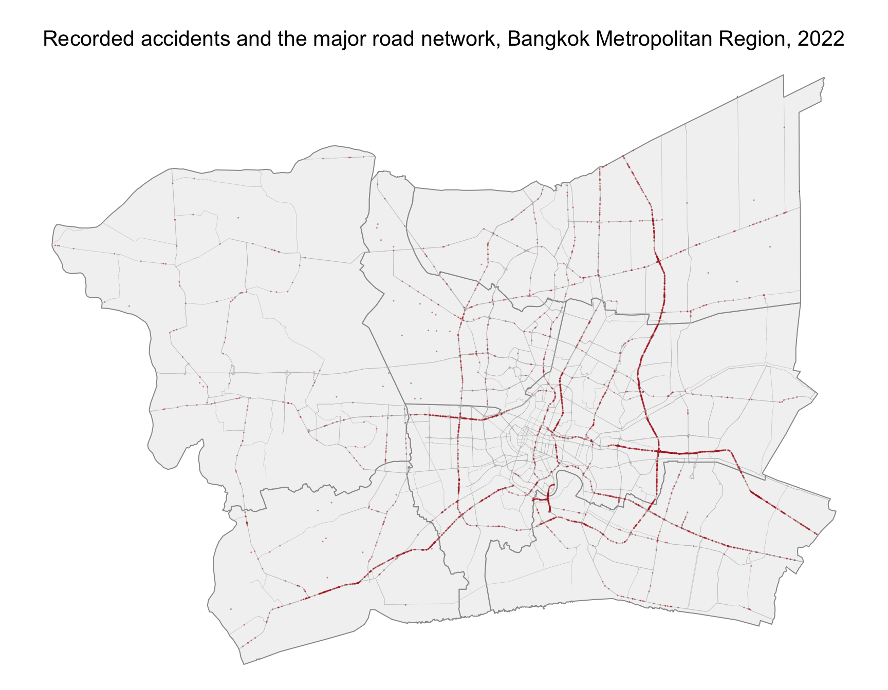
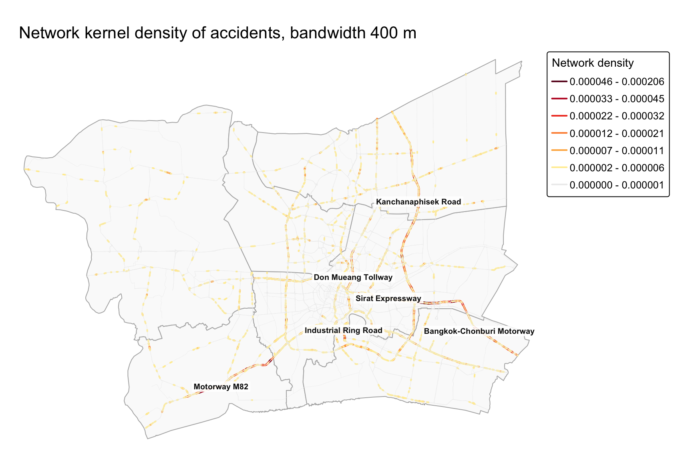
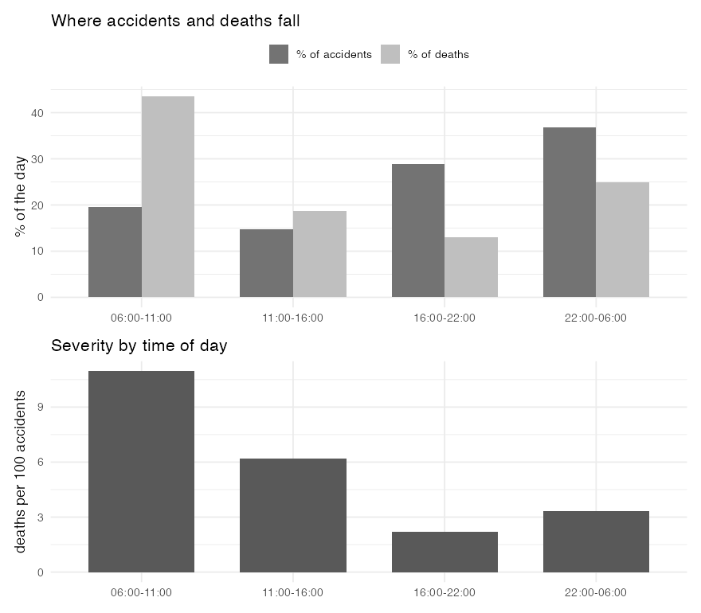
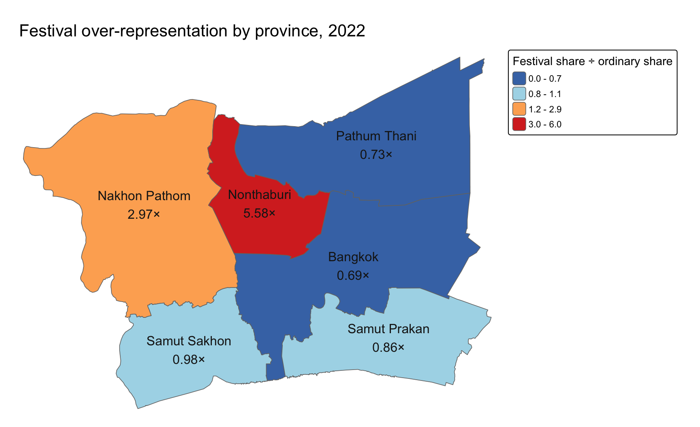

## Contents

1. Research question and objectives
2. Study area and data
3. Analytical approach
4. Intensity concentrates on six corridors
5. Clustering exceeds the road hierarchy
6. The deadliest window is the morning
7. Festival windows are 3.4 times as lethal
8. Limitations
9. Public-safety implications
10. Key findings

## Research question and objectives

Where and when do road traffic accidents concentrate in the Bangkok Metropolitan Region, and does
that concentration exceed what the road network alone would produce?

::: {.columns}
::: {.column width="50%"}
**Objectives**

- Estimate how intensity varies across the network
- Establish whether accidents cluster beyond what road hierarchy explains
- Identify variation through the year and across the day
:::
::: {.column width="50%"}
**Scope**

- Six provinces of the Bangkok Metropolitan Region
- 7,604 km²
- Calendar year 2022
:::
:::

## Study area and data

::: {.columns}
::: {.column width="56%"}
**Six provinces, calendar year 2022**

- **3,599** accidents, from 81,735 national records
- **23,189** segments, 7,329 km, OpenStreetMap
- Boundary from geoBoundaries ADM1

. . .

Data quality:

- **Motorcycles are 11.3% of records**, against 73% of national road deaths
- **14.4% of accidents sit at 199 repeated coordinates**, at a tenth the usual fatality rate
- **Coordinates carry no height**, so street accidents beneath the elevated tollways are attributed
  to the expressway above them, which inflates the motorway rate
:::
::: {.column width="44%"}

:::
:::

## Analytical approach

Accidents are constrained to roads, so they are treated as a point pattern on a linear network.

::: {.columns}
::: {.column width="50%"}
**Method**

- **First order: intensity.** Network kernel density estimation; discontinuous estimator, quartic
  kernel, bandwidth 400&nbsp;m
- **First order: over time.** The same estimator with a second kernel over the hour of day (TNKDE),
  at 400&nbsp;m and 2&nbsp;hours
- **Second order: clustering.** Network **K and G functions** with a Monte Carlo envelope, against
  a **class-weighted null**
:::
::: {.column width="50%"}
**Why the network matters**

- Accidents sit a median **4.1 m** from the nearest major road, 98% within 20 m
- A planar estimate measures straight-line distance, which passes over ground where an accident
  cannot occur
:::
:::

## Intensity concentrates on six corridors

::: {.columns}
::: {.column width="41%"}
{height=470}
:::
::: {.column width="59%"}
- **Six corridors** hold the densest stretches: Bangkok-Chonburi Motorway, Industrial Ring Road,
  Motorway M82, Kanchanaphisek Road, Don Mueang Tollway and Sirat Expressway. **79.2%** of the
  network carries none
- **Industrial Ring Road carries 30 times** its class expectation, while **every expressway
  carries less**: Sirat 0.39, Chalong Rat 0.38, Buraphawithi 0.34
- **Count and harm disagree**: Bangkok-Chonburi Motorway is second by count with **1 fatality in
  591 accidents**, and Buraphawithi has **5** on a tenth the accidents
- Part of the ranking is **recording practice**: contamination runs from **1.2% to 50.0%**
:::
:::

## Clustering exceeds the road hierarchy

::: {.columns}
::: {.column width="46%"}
{height=430}
:::
::: {.column width="54%"}
- Observed K sits above the class-weighted envelope at **every distance** from 200 m to 2 km, and
  the ratio to it falls from **6.92 to 3.46**
- The **G function**, which counts pairs within a ring at each distance, exceeds the same
  envelope, so the answer does not depend on how pairs are counted
- A whole-curve rank test returns **p = 0.010**, so the rejection is not an artefact of testing
  distances one at a time
- **Clustering above the envelope** is strongest at about **200 m**, the junction scale: **half of all
  accidents lie within 200 m of a junction**
:::
:::

## The deadliest window is the morning

::: {.columns}
::: {.column width="54%"}
{height=440}
:::
::: {.column width="46%"}
- **06:00 to 11:00** holds **19.5% of accidents but 43.5% of deaths**, 77 of the 177, a rate of
  **11.0 per 100**
- **Night is the less severe half**: on a 22:00 to 05:00 split, **20.3% of deaths** at **3.0 per
  100**, against **5.8** by day
- The temporal surface names a corridor for the morning: **Industrial Ring Road** holds the densest
  point on the network from **04:00 to 07:00**
:::
:::

## Festival windows are 3.4 times as lethal

Sharp increases occur in April (Songkran) and December (New Year), the two national periods known
as the seven dangerous days (Road Safety Thailand, 2022).

::: {.columns}
::: {.column width="50%"}
{height=420}
:::
::: {.column width="50%"}
- Fourteen days carry a fatality rate of **13.9 per 100** against **4.1** otherwise
- Motorcycles rise from **9.3%** of ordinary-period records to **33.4%** of festival ones
- **Nonthaburi takes 5.58 times** its ordinary share of accidents, while **Bangkok falls to 0.69**
:::
:::

## Limitations

- **No exposure measure.** Accident rate by road class is computed from the accidents themselves,
  so a busy road cannot be distinguished from a hazardous one
- **One year, and not a stationary one.** The second half of 2022 carries 33% more accidents as
  traffic recovered from the pandemic, so seasonal claims are limited to the festival windows
- **No edge correction.** The density surface's loss is measured at 0.24%; the K envelope is
  simulated on the same network, so the comparison largely cancels it
- **Selective coverage**, skewed toward four-wheel vehicles on Ministry of Transport roads
- **The null is composite.** The class weights are estimated from the observed accidents, so the
  p-value above is approximate

## Public-safety implications

- **Morning deployment.** The 06:00 to 11:00 window holds 19.5% of accidents but 43.5% of deaths,
  against 2.2 per 100 for the evening peak. Counts point deployment at the evening, deaths at the
  morning, and the temporal surface names Industrial Ring Road for it
- **Festival enforcement.** Fourteen days run 3.4 times the fatality rate of the rest of the year,
  on dates Thailand already campaigns on
- **Junction-scale engineering.** Clustering beyond road class peaks near 200 m, pointing to junction
  redesign, signal retiming and approach lighting, which act at this scale

. . .

- **What the evidence cannot support.** Ranking specific locations for investment. The intensity
  surface is not a rate, 14.4% of accidents sit at coordinates that appear administrative, and no
  source here captures motorcycle casualties

## Key findings

- **Where.** Six corridors hold the density, and **Industrial Ring Road carries 30 times** what its
  length and road class predict
- **Whether it exceeds the hierarchy.** It does, and that clustering is short-range: the ratio to
  the class-weighted envelope falls from **6.92 at 200 m to 3.46 at 2 km**
- **When.** Severity peaks in the **06:00 to 11:00** window at **11.0 deaths per 100 accidents**, and
  the festival windows are **3.4 times** as lethal as the rest of the year
- **Against the literature.** The festival pattern confirms Iamtrakul and Chayphong (2025); the
  morning concentration runs against them, since they report night-time fatalities
- **What limits it.** No exposure measure, Ministry of Transport roads only, and coverage that
  understates motorcycle casualties

The full analysis, code and data are in the accompanying technical report.

. . .

**Key references.** Iamtrakul and Chayphong (2025); Gelb and Apparicio (2023); Xie and Yan (2008);
Okabe, Satoh and Sugihara (2009).
