# Introduction and study context {#sec-intro}

Road traffic deaths are a leading cause of death in Thailand. The Bangkok Metropolitan Region covers six provinces, and its road network carries the densest traffic in the country.

This report analyses where and when road traffic accidents concentrated in that region during 2022. The analysis treats accidents as a point pattern **constrained to the road network**. They are not scattered freely across a plane.

## Scope and structure

| Requirement | Additional analysis | Answers | Section |
|------------------------|------------------------|---------|------------------------|
| Task 1: data preparation and quality assessment | Geometry checked after clipping, and the duplicate coordinates identified | n/a | @sec-prep |
| Task 2: first-order intensity | Variation by festival window, by time of day, and along corridors | RQ1, RQ2 | @sec-first, @sec-temporal |
| Task 3: second-order interaction against a null model | A class-weighted null in place of the default uniform null, and the repeat-coordinate artefact | RQ1, RQ3 | @sec-second |
| Task 4: integration of the two orders | Corridor load against class expectation, and the divergence between count and harm | RQ1, RQ2, RQ3 | @sec-integration, @sec-corridor-ratio |
| Task 5: geovisualisation | Classification of a zero-inflated density surface, with the method justified | n/a | @sec-geovis |
| Task 6: planning implications | The scale at which excess clustering occurs, and the time of day it concentrates | n/a | @sec-planning |
| Sensitivity where appropriate | Estimator comparison, bandwidth sensitivity, lixel length, time bandwidth, verification of the density scale, and the festival window edges | n/a | @sec-first, @sec-temporal |

## Festival periods

Thai road safety counts accidents across two seven-day periods each year, both known as the seven dangerous days (Road Safety Thailand, reported in Nation Thailand, 2022):

- **New Year**, late December into early January.
- **Songkran**, the Thai New Year, in mid-April.

The New Year window straddles the year boundary, so the 2022 record holds three of its days, 29 to 31 December, and four belonging to the next cycle, 1 to 4 January.

Kungsukun et al. (2024) report that in 2024 the national average was 38 road deaths per day, rising to 69 per day during the New Year and Songkran periods.

# Research question and objectives {#sec-question}

The study asks three questions.

1.  **Where** does accident intensity concentrate along the road network, and does that concentration persist once the differing accident rates of road types are accounted for?
2.  **When** does intensity change through the year, and is the temporal pattern stable across the region?
3.  **Do accidents cluster beyond what road hierarchy alone would produce?** This is a second-order question, and it requires a reference model that already reflects the uneven spread of accidents across road classes.

The objectives follow from these: prepare and integrate the data, estimate first-order intensity on the network, test second-order interaction against an appropriate null, and translate the result into implications for road-safety planning.

# Data and study design {#sec-data}

## Software and packages

The analysis uses six packages, loaded once here. `spNetwork` provides the network kernel density estimator and the network K function, and is introduced for the first time in this exercise.

```{r}
#| label: setup
pacman::p_load(sf, spNetwork, tmap, tidyverse, knitr, classInt)
sf_use_s2(FALSE)
set.seed(1234)
```

`sf_use_s2(FALSE)` switches off spherical geometry so that distance operations use planar coordinates in the projected CRS. The seed is set once, before anything random runs, so that the simulation envelopes in the second-order analysis reproduce on every render.

## Sources

| Dataset | Source | Access | Geographic coverage | Temporal coverage | Relevant characteristics |
|------------|------------|------------|------------|------------|------------|
| Road accidents | Thailand Road Accident 2019-2022, Kaggle (`thaweewatboy/thailand-road-accident-2019-2022`) | 13 Sep 2026 | Thailand, 81,735 records; 3,599 inside the Bangkok Metropolitan Region after the filters below | 2019 to 2022; restricted here to calendar 2022 | Ministry of Transport road-network dataset, so it covers Department of Highways, Department of Rural Roads and Expressway Authority roads only. One row per accident, geocoded, with vehicle type, location type, presumed cause, weather and severity counts |
| Road network | OpenStreetMap via Overpass API, four tiles | 14 Sep 2026 | Bangkok Metropolitan Region bounding box, 13.42 to 14.28 N and 99.80 to 100.97 E | OSM state at the access date. OSM carries no historical version, so the network reflects the access date | Motorway, trunk, primary and secondary classes with their link roads. 23,189 segments totalling 7,329 km after clipping to the study window |
| Administrative boundary | geoBoundaries ADM1, Thailand | 13 Sep 2026 | 77 provinces nationally; six retained for the Bangkok Metropolitan Region | gbOpen release, current at the access date | Province polygons, used to define the study window |

The brief offers two datasets for this case study. The 2024 fatality file is the alternative to the 2019-2022 file used here, and it was rejected on two grounds.

The file's column names are the wrong way round. The latitude values sit in `acc_long`, and the longitude values in `acc_lat`.

Even with that corrected, three quarters of the file's 12,762 rows carry no coordinates, leaving 530 usable records in the Bangkok Metropolitan Region, against 3,599 from the 2019-2022 dataset.

## Study window

A point event is one recorded accident, geocoded to a single coordinate pair, that occurred in calendar year 2022 inside the six provinces of the Bangkok Metropolitan Region. The study window is the six geoBoundaries ADM1 polygons for Bangkok, Nonthaburi, Pathum Thani, Samut Prakan, Samut Sakhon and Nakhon Pathom, selected by name from the layer's 77 provinces.

The brief names the Bangkok Greater Metropolitan Area. That name has no fixed extent: Greater Bangkok is Bangkok with three provinces, the Bangkok Metropolitan Region is Bangkok with five, and the Extended Bangkok Metropolitan Region adds four more. This study uses the Bangkok Metropolitan Region. Iamtrakul and Chayphong (2025) analyse 31,687 road crashes across the same six provinces.

The six provinces are held as separate features so that per-province counts remain available, and their union is used only to clip the road network. Together they enclose 7,604 km², measured in EPSG:32647. Events are retained where they fall within any of the six provinces.

::: callout-note
## The Bangkok Metropolitan Region

The Bangkok Metropolitan Region is a planning region comprising Bangkok plus five adjacent provinces, Nonthaburi, Pathum Thani, Samut Prakan, Samut Sakhon and Nakhon Pathom.

Bangkok province is 1,571 km², 21% of the 7,604 km² window, and holds 1,802 of the 3,599 recorded accidents. Nakhon Pathom is the largest province at 2,088 km² and holds the fewest, 138.

`geoBoundaries` labels administrative levels by depth:

- ADM0: the nation, Thailand
- ADM1: its 77 provinces, six of which form the study window
- ADM2: the districts within each province

```{r}
#| label: map-provinces
#| fig-height: 5.5
#| echo: false
# Read here; the load chunk below, which runs later in the document.
ctx <- st_read("data/derived/bmr_boundary.gpkg", quiet = TRUE) |> st_zm(drop = TRUE, what = "ZM")
cnt <- st_read("data/derived/bmr_accidents_2022.gpkg", quiet = TRUE) |>
  st_join(ctx["shapeName"]) |> st_drop_geometry() |> count(shapeName, name = "n")

ctx <- ctx |>
  left_join(cnt, by = "shapeName") |>
  mutate(lab = sprintf("%s\n%s", sub(" Province$", "", shapeName), format(n, big.mark = ",")))

tmap_mode("plot")
tm_shape(ctx) +
  tm_polygons(fill = "n",
              fill.scale = tm_scale_intervals(
                style = "jenks", n = 5,
                values = c("grey92", "#FEE391", "#FEC44F", "#EC7014", "#8C2D04")),
              col = "grey35", lwd = 1) +
  tm_text("lab", size = 0.9, col = "grey15", bgcol = "white", bgcol_alpha = 0.8) +
  tm_title("Recorded accidents by province, Bangkok Metropolitan Region, 2022", size = 1.3) +
  tm_layout(frame = FALSE, legend.show = FALSE)
```
:::

The temporal window is the complete calendar year 2022, which contains a structural break. Thailand relaxed its remaining COVID-19 controls during 2022, and recorded accidents rose through the year as traffic recovered from the pandemic (Tongpradubpetch and Kanitpong 2024). The year is therefore not stationary, which constrains what can be claimed about seasonality; temporal structure quantifies the rise. All layers are transformed to EPSG:32647, WGS 84 / UTM zone 47N, the projected system covering central Thailand, so every distance and bandwidth below reads in metres.

```{r}
#| label: load
boundary  <- st_read("data/derived/bmr_boundary.gpkg", quiet = TRUE) |>
  st_zm(drop = TRUE, what = "ZM")
accidents <- st_read("data/derived/bmr_accidents_2022.gpkg", quiet = TRUE) |>
  st_zm(drop = TRUE, what = "ZM")
network <- st_read("data/derived/bmr_network.gpkg", quiet = TRUE) |>
  st_zm(drop = TRUE, what = "ZM")
lixels  <- st_read("data/derived/bmr_nkde_lixels.gpkg", quiet = TRUE) |>
  st_zm(drop = TRUE, what = "ZM")

accidents$day <- as.Date(accidents$incident_datetime)
accidents$festival_window <-
  (accidents$day >= as.Date("2022-04-11") & accidents$day <= as.Date("2022-04-17")) |
  (accidents$day >= as.Date("2022-12-29")) |
  (accidents$day <= as.Date("2022-01-04"))

c(provinces = nrow(boundary),
  accidents = nrow(accidents),
  segments  = nrow(network),
  network_km = round(sum(network$km)))
```

::: callout-note
## How the code works

Four layers are read and one field is derived.

- `st_read()` reads a single layer from a GeoPackage.
- `st_zm()` drops any Z or M dimension. No layer carries a height, so the calls are no-ops on this data. They are kept because a Z dimension breaks several point-pattern functions, and the files' dimensionality is not visible in the code.
- `as.Date()` converts `incident_datetime` to a date, and every comparison below is made at day level.
- Comparing a timestamp against a bare `Date` would coerce the bound to midnight and drop everything recorded later that day. That would silently remove two of the fourteen festival days.
:::

# Data preparation and quality assessment {#sec-prep}

## Record filtering

The source file covers four years and the whole country. Each filter below is applied in turn, and the number of records removed is recorded so that the analysis set can be audited from the raw file.

```{r}
#| label: filtering-trail
raw <- read_csv("data/rawdata/thai_road_accident_2019_2022.csv", show_col_types = FALSE)
boundary  <- st_read("data/derived/bmr_boundary.gpkg", quiet = TRUE)

counts <- nrow(raw)

d <- raw |> filter(lubridate::year(incident_datetime) == 2022)
counts <- c(counts, nrow(d))

d <- d |> filter(!is.na(latitude), !is.na(longitude))
counts <- c(counts, nrow(d))

d <- d |> filter(latitude > 5.5, latitude < 20.6, longitude > 97.2, longitude < 105.8)
counts <- c(counts, nrow(d))

d <- d |>
  st_as_sf(coords = c("longitude", "latitude"), crs = 4326) |>
  st_transform(32647)
d <- d[lengths(st_intersects(d, boundary)) > 0, ]
counts <- c(counts, nrow(d))

tibble(
  step = c("Raw file, 2019 to 2022", "Filter to 2022", "Drop missing coordinates",
           "Drop coordinates outside Thailand", "Drop outside the Bangkok Metropolitan Region"),
  removed = c(NA, -diff(counts)),
  remaining = counts) |>
  mutate(removed = if_else(is.na(removed), NA_character_,
                           formatC(removed, big.mark = ",")),
         remaining = formatC(remaining, big.mark = ",")) |>
  kable(col.names = c("Step", "Removed", "Remaining"))
```

Three coordinates in the file fall outside Thailand's bounding box, two from 2019 and one from 2020, so the Thailand filter removes no records from the 2022 set.

## Duplicate coordinates

```{r}
#| label: duplicates
co <- st_coordinates(accidents)
tibble(points          = nrow(accidents),
       distinct_coords = nrow(unique(co)),
       duplicated      = sum(duplicated(co)),
       pct             = round(100 * mean(duplicated(co)), 1),
       max_at_one_spot = max(table(paste(co[,1], co[,2])))) |> kable()
```

Repeated coordinates are **not** duplicate records. Only two rows repeat on coordinate *and* timestamp. The rest are genuine separate accidents at the same location, which is expected at junctions. They are retained, but they must be displaced before any distance-based method is applied, because exact ties inflate short-range statistics without limit. @sec-jitter quantifies that effect on the network K function.

## Repeat coordinates and the reporting artefact {#sec-repeat}

A small number of coordinates carry many accidents. They are not hazardous locations.

- **14.4% of the accidents sit at 199 coordinates**, each carrying two or more.
- **Their fatality rate is 0.6 per 100 accidents against 5.7 at single-accident coordinates**, so they concentrate minor damage.
- **The busiest holds 16 accidents across six months**, every one logged as speeding and none fatal, on a motorway.

The last of those is the signature of a default logging location such as a toll plaza or patrol post, so part of what the density surface identifies is recording practice.

```{r}
#| label: repeat-sites
accidents |>
  st_drop_geometry() |>
  mutate(site = if_else(n_at_site > 1, "Repeat coordinate (2 or more)", "Single-accident coordinate")) |>
  group_by(site) |>
  summarise(accidents = n(),
            fatalities = sum(number_of_fatalities, na.rm = TRUE),
            fatal_per_100 = round(100 * sum(number_of_fatalities, na.rm = TRUE) / n(), 1),
            .groups = "drop") |>
  kable()
```

Repeat locations behave unlike hazardous ones: a black spot concentrates harm, and these dilute it.

The consequence for the corridor ranking is direct.

::: callout-note
## Corridors

A corridor is a named road in the dataset. The intensity attributed to a corridor is the highest value the density surface reaches anywhere along it, and the corridor ranking orders named roads by that value. @sec-corridors-peak sets out the method and the caveats.
:::

```{r}
#| label: artefact-contamination
accidents |>
  st_drop_geometry() |>
  filter(!is.na(road_name)) |>
  group_by(road_name) |>
  summarise(accidents = n(),
            pct_at_repeat_coords = round(100 * mean(n_at_site > 1), 1),
            fatalities = sum(number_of_fatalities, na.rm = TRUE),
            fatal_per_100 = round(100 * sum(number_of_fatalities, na.rm = TRUE) / n(), 1),
            .groups = "drop") |>
  arrange(desc(accidents)) |> head(10) |> kable()
```

Corridors differ enormously in how much of their count comes from repeat coordinates, from 1.2% on Kanchanaphisek Road to 50.0% on Chaloem Mahanakhon Expressway. The contamination runs against severity: the two most contaminated corridors carry 1.5 and 0.2 fatalities per 100 accidents, against 5.7 at single-accident coordinates. **Part of the intensity surface estimated in @sec-first therefore maps recording practice as much as it maps hazard.**

## Attribute quality

```{r}
#| label: attributes
accidents |>
  st_drop_geometry() |>
  summarise(
    fatalities = sum(number_of_fatalities, na.rm = TRUE),
    injuries   = sum(number_of_injuries,   na.rm = TRUE),
    vehicle_types  = n_distinct(vehicle_type),
    accident_types = n_distinct(accident_type),
    weather_levels = n_distinct(weather_condition)) |>
  kable()
```

A cross-check between the recorded province and the province each point falls in finds **14 records (0.4%)** that disagree, including four labelled Kanchanaburi and four labelled Phra Nakhon Si Ayutthaya, neither of which is in the Bangkok Metropolitan Region. All 14 records are retained and placed by their coordinates. The recorded province is not used later: every analysis step locates each accident by its coordinate pair, so the disagreement changes no result.

## Temporal structure

```{r}
#| label: monthly
#| fig-height: 4
m <- accidents |>
  st_drop_geometry() |>
  mutate(month = lubridate::month(incident_datetime, label = TRUE)) |>
  count(month, name = "accidents")

ggplot(m, aes(month, accidents, group = 1)) +
  geom_col(fill = "grey35") +
  labs(x = NULL, y = "accidents",
       title = "Recorded accidents by month, Bangkok Metropolitan Region, 2022") +
  theme_minimal()
```

Recorded accidents peak in October at 393 and trough in February at 214, against a monthly mean of 300. The festival months are elevated. April, which contains Songkran, records 330 and December 369, both above the mean, though October at 393 rises above them and the dataset carries no field that explains it.

### Festival windows

```{r}
#| label: festival
accidents$date <- as.Date(accidents$incident_datetime)
stopifnot(!all(is.na(accidents$date)))
all_days <- data.frame(date = seq(as.Date("2022-01-01"), as.Date("2022-12-31"), "day"))
daily <- left_join(all_days, count(st_drop_geometry(accidents), date, name = "n"), by = "date")
daily$n[is.na(daily$n)] <- 0
baseline <- mean(daily$n)

window_rate <- function(from, to, label) {
  w <- daily |> filter(date >= as.Date(from), date <= as.Date(to))
  tibble(period = label, days = nrow(w), accidents = sum(w$n),
         per_day = round(mean(w$n), 1), vs_baseline = round(mean(w$n) / baseline, 2))
}

bind_rows(
  tibble(period = "Whole year", days = nrow(daily), accidents = sum(daily$n),
         per_day = round(baseline, 1), vs_baseline = 1),
  window_rate("2022-04-11", "2022-04-17", "Songkran"),
  window_rate("2022-12-29", "2022-12-31", "New Year, December"),
  window_rate("2022-01-01", "2022-01-04", "New Year, January")) |> kable()
```

Accidents run at roughly twice the daily baseline during Songkran and three times during the final days of December. **Eight of the ten worst days of 2022 fall inside these two windows**, and the worst single day of the year is 29 December with 36 accidents against a daily mean of 9.9.

### Pandemic recovery as a confounder

```{r}
#| label: halves
accidents |>
  st_drop_geometry() |>
  mutate(half = if_else(lubridate::month(incident_datetime) <= 6, "Jan-Jun", "Jul-Dec")) |>
  count(half, name = "accidents") |>
  kable()
```

The second half of 2022 carries 33% more recorded accidents than the first. Thailand lifted most remaining COVID-19 controls and reopened to tourism during mid-2022, so traffic volume was rising across the period. Part of the second-half increase is the December festival surge and part is the recovery in traffic. The data cannot separate the festival surge from the traffic recovery, so no seasonal claim is made beyond the festival windows, which are identifiable because they are short and dated.

## Network preparation

```{r}
#| label: network-classes
network |>
  st_drop_geometry() |>
  group_by(cls) |>
  summarise(segments = n(), km = round(sum(km)), .groups = "drop") |>
  arrange(desc(km)) |>
  kable()
```

::: callout-note
## Road classes

`cls` is the OpenStreetMap `highway` tag of the nearest segment. The values form a hierarchy of capacity:

- **motorway**: controlled-access divided highway. On this network the class holds the tolled roads, including the Sirat, Chaloem Mahanakhon and Chalong Rat expressways, the Bangkok-Chonburi Motorway and Route 81.
- **trunk**: the most important roads that are not motorways, including Sukhumvit, Rama II, Vibhavadi Rangsit and Borommaratchachonnani.
- **primary** and **secondary**: the arterial and distributor roads below those.
- **`*_link`**: slip roads and ramps at interchanges and junctions. Together they account for 1,056 km of the 7,329 km network.
:::

Only motorway, trunk, primary and secondary roads and their link roads are retained. Minor residential and service roads are excluded because recorded accidents in this dataset sit overwhelmingly on the major network, and including the full OSM network adds computation without adding events. The consequence is recorded in the limitations: per-kilometre denominators exclude the minor network.

::: callout-warning
## Elevated expressways

Bangkok has many roads on two levels. Elevated tollways sit directly above surface streets, as the Bang Na Expressway does above the Bang Na-Trat Road. The accident coordinates carry no height, so a point on the expressway and a point on the street below it can occupy the same position. Assigning each accident to its nearest segment at a four-metre median tolerance therefore attributes some surface-street accidents to the expressway above them.

The effect falls on the class rate computed in @sec-second, which this ambiguity inflates by an unknown amount, and through it on the class weights behind the null in @sec-classw and the expected counts behind the corridor ratios in @sec-corridor-ratio.
:::

Before the analysis the retained network and the recorded accidents are drawn on one map. Showing them together is a check that the accidents lie along the roads, because every distance the analysis computes is measured along the network.

```{r}
#| label: coverage-check
#| fig-width: 8
#| fig-height: 6
tmap_mode("plot")
tm_shape(boundary) + tm_polygons(fill = "grey96", col = "grey70", lwd = 0.4) +
  tm_shape(network) + tm_lines(col = "grey80", lwd = 0.18) +
  tm_shape(accidents) + tm_dots(fill = "firebrick", size = 0.04, fill_alpha = 0.32) +
  tm_title("Recorded accidents against the analysed network") +
  tm_layout(frame = FALSE)
```

Recorded accidents trace the retained network and do not fill the region. They concentrate on the outer ring road, Kanchanaphisek, and on the radial expressways running out of the city. The first-order section examines that concentration by road class. The western provinces carry a dense network with comparatively few recorded events, which reflects the dataset's road coverage.

::: callout-important
## Geometry type after clipping

```{r}
#| label: geometry-trap
#| eval: false
multi <- st_intersection(roads, boundary) |> st_collection_extract("LINESTRING")
single <- st_cast(multi, "LINESTRING")

length_of <- function(x) {
  lixels <- lixelize_lines(x, 200, mindist = 100)
  c(segments = nrow(x), network_km = round(sum(as.numeric(st_length(x))) / 1000),
    lixels = nrow(lixels), lixel_km = round(sum(as.numeric(st_length(lixels))) / 1000))
}
rbind(MULTILINESTRING = length_of(multi), LINESTRING = length_of(single))
```

`st_intersection()` followed by `st_collection_extract("LINESTRING")` returns MULTILINESTRING geometries, and `lixelize_lines()` inflates those silently.

- Bangkok subset without `st_cast("LINESTRING")`: 3,267 km became 59,789 km across 298,947 lixels, an 18-fold error with no warning.
- The same input with `st_cast`: 3,267 km across 22,388 lixels.
- The regional network used here: 7,329 km across 46,110 lixels.

Every per-kilometre figure depends on this step.

`st_is_valid()` is run separately on all four derived layers, because the `spNetwork` functions fail on invalid geometry without warning. None of the network, accident, boundary or lixel features is invalid or empty.
:::

# Analytical assumptions and methodological decisions {#sec-assumptions}

## Rationale for the two-stage design {#sec-rationale}

The report runs two analyses. The first estimates how accident intensity varies along the network, from the event locations alone. The second tests whether those locations influence one another, from the distances between the events.

::: callout-note
## Why a density surface cannot answer the second question

An inhomogeneous process, in which intensity varies from place to place while the events stay independent of one another, produces the same aggregated pattern as a process in which the events genuinely attract each other. Floch, Marcon and Puech (2018), put the point in both directions: observed aggregation can come from a varying intensity or from interaction, and a single observation does not separate the two.

The second-order test separates them by comparing the observed pattern against a null in which the events are independent but the intensity is not uniform. Both halves of that null matter. A uniform null would reject on the intensity variation alone, which reflects the road hierarchy and implies nothing about interaction between accidents.
:::

The pairing of a network intensity estimate with a network second-order test follows Al-Aamri et al. (2021), who analyse 9,357 road traffic crashes in Muscat, Oman, over 2010 to 2014, running a network kernel density estimate alongside a network nearest-neighbour distance and a network K function tested against Monte Carlo critical values.

| Reading | Also used in | What it contributes |
|------------------------|------------------------|------------------------|
| Al-Aamri et al. (2021) | @sec-second | Closest published pipeline. They pair a network kernel density estimate with a network nearest-neighbour distance and a network K function, tested against Monte Carlo critical values, and reject the planar density form because two points can lie close in straight-line distance and far apart by road |
| Floch, Marcon and Puech (2018) | This section only | The warning is that a single observation cannot separate the two orders, since a varying intensity and genuine interaction produce the same aggregated pattern |
| Tonini et al. (2017) | @sec-bandwidth | A cross-K and a spatio-temporal K function come before a 3D kernel density, which takes its bandwidth from that second-order result. Their order is the reverse of this report's, so the sequence here follows the brief |

Floch, Marcon and Puech and Tonini are both on the course's own reading lists. Al-Aamri is not, and is cited here as an external comparator; it is not assigned reading.

## Assumptions

Four assumptions underlie both point-pattern analyses.

**Stationarity.** The K function treats the accident process as having the same intensity everywhere in the window (the same expected number of accidents per kilometre anywhere on the network). The first-order results contradict that, since intensity varies sharply across the six provinces (Bangkok holds half the accidents on a fifth of the area). That is why the second-order test uses a class-weighted null (simulated accidents fall in proportion to each road class's own rate, in place of a uniform one based on length alone).

**Dependence on network distance.** Distance is measured along the roads (how far a driver would travel), so the direction between two events makes no difference to the estimate. It does assume that dependence depends only on network distance, whatever the road class involved. The class-weighted null in @sec-classw removes part of that assumption, and Limitation 2 covers what remains.

**Independence of events.** Each accident is treated as an independent event. Repeat coordinates at roughly 200 sites are the clearest departure from that assumption. @sec-repeat measures how much of the corridor ranking the artefact accounts for, and @sec-jitter how much of the short-range clustering.

**The network as the complete window.** Events are analysed on the retained major network. Accidents on the excluded minor network are unobserved, so a cluster near a boundary between the two networks is partly outside the window. Limitations 7 and 9 record the consequences.

## Network constraint {#sec-network-constraint}

```{r}
#| label: snap
nr <- st_nearest_feature(accidents, network)
d  <- as.numeric(st_distance(accidents, network[nr, ], by_element = TRUE))

tibble(median_m = round(median(d), 1),
       p90_m    = round(quantile(d, 0.90), 1),
       p99_m    = round(quantile(d, 0.99), 1),
       max_m    = round(max(d), 1),
       within_20m_pct = round(100 * mean(d <= 20), 1)) |> kable()
```

Half of all accidents sit within about four metres of a major road and 98% within twenty metres. The offsets have more than one cause: an accident can be recorded away from the centreline, on a shoulder or lane edge, and where a road is divided the two sources represent it differently. No record lies exactly on a centreline, which is what snapping the coordinates to the road geometry would produce. The distribution supports treating the events as constrained to the network.

The figure below shows the largest offsets in the network. On a divided road OpenStreetMap carries a centreline for each carriageway while the dataset places its coordinates between them, so every accident on this stretch of the Bangkok-Chonburi Motorway sits about 11 m from the nearest line, half the 23 m separating the carriageways. The median on that motorway is 6 m.

Every network estimator used here snaps each event to the nearest point on the network before measuring, so the analysis works from positions snapped onto the lines. The offsets measured above are the distances that snap removes: about 4 m for the median accident, and 11 m in the figure.

```{r}
#| label: map-zoom
#| out-width: "100%"
#| echo: false
# Zoom on the Bangkok-Chonburi Motorway in Samut Prakan.
zoom <- st_sfc(st_point(c(703946, 1509072)), crs = st_crs(accidents)) |> st_buffer(150)
bg   <- st_as_sfc(st_bbox(zoom) + c(-40, -40, 40, 40)) |> st_as_sf()
znet <- network[lengths(st_intersects(network, zoom)) > 0, ]
zacc <- accidents[lengths(st_intersects(accidents, zoom)) > 0, ]

tmap_mode("plot")
tm_shape(bg) + tm_polygons(fill = "grey94", col = NA) +
  tm_shape(znet[znet$cls != "motorway", ]) + tm_lines(col = "grey72", lwd = 1.5) +
  tm_shape(znet[znet$cls == "motorway", ]) + tm_lines(col = "grey12", lwd = 3) +
  tm_shape(zacc) + tm_dots(fill = "firebrick", col = "grey5", size = 0.5) +
  tm_add_legend(type = "line", col = c("grey12", "grey72"),
                labels = c("Motorway carriageway", "Other road"),
                title = "OpenStreetMap") +
  tm_add_legend(type = "symbol", fill = "firebrick", col = "grey5",
                labels = "Recorded accident", title = "Accident data") +
  tm_scalebar(position = c("left", "bottom")) +
  tm_title("Accidents midway between the carriageway centrelines", size = 1.4) +
  tm_layout(frame = TRUE, frame.lwd = 1.4, legend.position = c("right", "top"),
            legend.text.size = 1.25, legend.title.size = 1.4,
            component.autoscale = FALSE)
```

Roughly 1% of records sit more than 600 metres from any major road. These are either accidents on the minor network, which this study excludes, or geocoding failures. They are retained for the first-order estimate and flagged in the limitations.

## Reference model for the second-order analysis {#sec-reference-model}

The network K function implemented by `kfunctions()` is the network form of the statistic, following Okabe and Sugihara (2012). Its default null scatters simulated accidents uniformly along the network, which assumes a constant accident rate per kilometre on every road. That assumption is testable and false for these data, as @sec-default-null shows. The second-order test therefore uses a **class-weighted null** in which simulated accidents are drawn in proportion to each road class's own observed rate.

The default null is false for these data. Motorway carries about 4.7 times the accidents a uniform null predicts and secondary about a third, so a K test against it rejects at every distance for a reason unconnected to interaction between accidents. Substituting a class-weighted null asks a different question, whether accidents cluster beyond what the road-class composition of the network produces. On these data the answer is yes from 200 m onward (@sec-classw). Chapter 7 demonstrates the default null only. The population-adjusted null is standard in this literature, and Hohl et al. (2017) use it, weighting simulated events by population; this analysis weights them by road class.

The weights are computed from the accident counts themselves, so the null conditions on the outcome. It tests clustering beyond road-class composition; it is not an exposure adjustment.

```{r}
#| label: class-weighted-sim
#| eval: false
# Each segment's expected accident count is its length times its class rate.
net$wt <- net$km * net$rate

# One simulated pattern: draw n segments in proportion to expected count, then a
# position uniformly along each chosen segment.
samp <- function() {
  idx <- sample(seq_len(nrow(net)), n, replace = TRUE, prob = net$wt)
  g   <- st_geometry(net)[idx]
  st_sf(geometry = st_sfc(mapply(function(ln, u) {
    st_line_sample(st_sfc(ln, crs = st_crs(net)), sample = u) |>
      st_cast("POINT") |>
      st_geometry() |>
      (\(x) x[[1]])()
  }, g, runif(n), SIMPLIFY = FALSE), crs = st_crs(net)))
}
```

The envelope is then the range of the K function over 99 draws from `samp()`, compared against the observed K computed on the accidents themselves. Each draw carries the network's class composition, so the envelope describes the range of clustering expected when class composition alone drives the pattern. The result is reported in @sec-classw.

# Network kernel density estimation {#sec-first}

The first research question asks where accident intensity concentrates along the road network. That is a first-order question: it concerns how the intensity of the process varies from place to place, estimated from the event locations alone, and it is settled before any question about whether accidents influence one another's positions. The second-order question is taken up in @sec-second.

The first-order instrument is network kernel density estimation (NKDE), which estimates intensity along the roads themselves.

## The network kernel density estimator

The estimate at a location $u$ on the network is a weighted sum of kernel contributions from the accidents around it:

$$\lambda(u) = \frac{1}{bw}\sum_{i=1}^{n} w_i K(\mathrm{dist}(u, e_i))$$

In this expression $bw$ is the bandwidth, $w_i$ is the weight of accident $i$, $\mathrm{dist}(u, e_i)$ is the network distance from $u$ to accident $i$, and $K$ is the kernel function.

Gelb (2021) defines the estimator in this form, and the course chapter applies it. The lecture slide writes the leading factor as $1/bw^2$, the form for an areal estimate. Distance along a network is one-dimensional, so the normaliser is $1/bw$, and `nkde()` returns values at that scale: summing density against lixel length reproduces $n/bw$ to within 0.24%, where $1/bw^2$ would be out by a factor of 400. That check is in @sec-density-scale.

The kernel function must be a probability density function, and it meets three conditions.

- **Non-negative inside the bandwidth.** $K(x) \ge 0$ where $x < bw$, so an accident contributes to the estimate at every point closer to it than the bandwidth.
- **Zero at the bandwidth and beyond.** $K(x) = 0$ where $x \ge bw$, which gives every accident a hard cutoff past which it contributes nothing.
- **Integrates to one.** Each accident carries a total mass of one, and that mass spreads along the network according to the shape of $K$.

```{r}
#| label: fig-nkde-schematic
#| out-width: "100%"
#| echo: false
#| fig-cap: "Schematic. Three accidents along a stretch of road, each spreading one unit of mass, and the density estimate that is their sum. Where two kernels overlap the sum rises above either one."
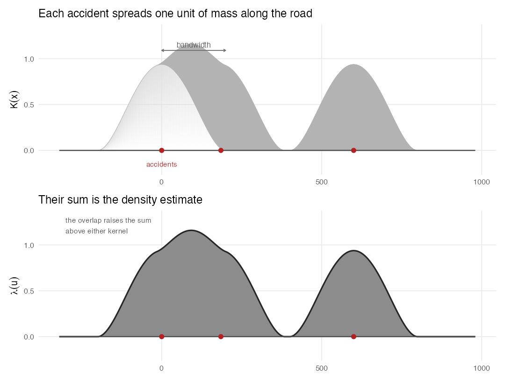
```

## Network against planar estimation

A planar kernel density estimate treats the plane as the space in which events occur, so it counts every accident within the search radius whether or not a road connects them. On a road network that is wrong in two directions at once: it reaches across ground where an accident cannot occur, and it treats accidents on neighbouring but unconnected roads as neighbours. Yamada and Thill (2004) compared the planar and network K functions on traffic accident data and found the planar form over-detects clustering. Al-Aamri et al. (2021), analysing crashes on a road network, give the reason in their own study: two points that are close in straight-line distance can be far apart by road, so a planar estimate misleads. Every estimate in this report is a network estimate.

```{r}
#| label: fig-planar-network
#| out-width: "100%"
#| echo: false
#| fig-cap: "Schematic. The same roads and accidents under two search rules. Left, a planar search takes every accident inside the straight-line radius. Right, a network search takes only those reachable within the same distance along the roads, which excludes two that the planar rule includes."
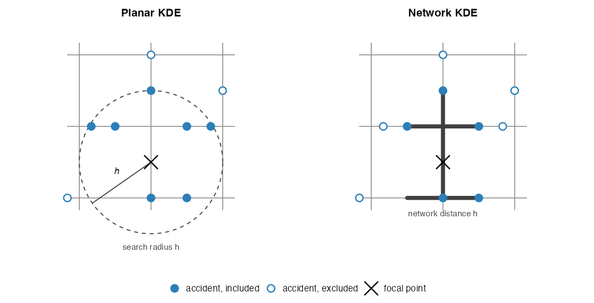
```

## Lixels, network distance and the non-isotropic kernel

Three steps turn planar kernel density estimation into this network form. The network is divided into lixels in place of pixels, and the centre of each lixel becomes a sampling point at which the density is estimated. Distances between a sampling point and an accident are measured along the network in place of straight-line distances. The kernel function is adjusted for an anisotropic space, because distance along a road does not run equally in all directions.

The first two steps are two calls.

```{r}
#| label: lixels
#| eval: false
lixels  <- lixelize_lines(network, 200, mindist = 100)   # spNetwork
samples <- lines_center(lixels)                          # spNetwork
```

`lixelize_lines()` cuts the network into lixels of 200 m, and `lines_center()` returns the centre of each one as the sampling point where the density will be read.

```{r}
#| label: fig-lixel-schematic
#| out-width: "100%"
#| echo: false
#| fig-cap: "Schematic. The same roads and accidents under two discretisations. Left, a planar grid of pixels, which takes no account of where the roads run. Right, the network cut into lixels, each a short segment whose centre becomes a sampling point."
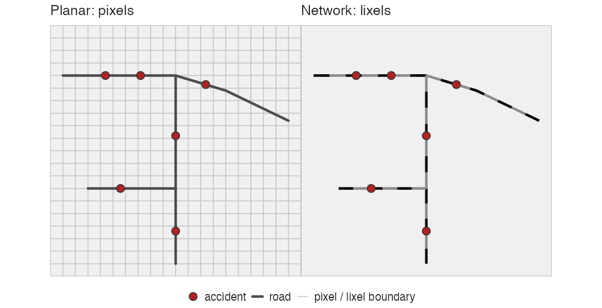
```

## Snapping events to the network

Every estimator used here requires the events to lie on the network, and each snaps them to the nearest point on a line before measuring. The course chapter describes the points handed to `kfunctions()` as ones that "will be snapped on the network", and `nkde()` behaves the same way.

The offsets it removes are measured in @sec-network-constraint: a median of about 4 m, with 98% of accidents within 20 m of a major road. The events are therefore treated as positions on the lines.

## The kernel function and its parameters

A kernel sets how an accident's unit of mass is distributed along the road, and the conditions above require every kernel to reach zero at the bandwidth. What separates them is the shape inside it, from the uniform, which spreads the mass evenly across the bandwidth, to the scaled gaussian, which concentrates it near the accident. `spNetwork` provides nine: the uniform, triangle, epanechnikov, quartic, triweight, tricube, cosine, gaussian and scaled gaussian.

```{r}
#| label: fig-kernel-functions
#| out-width: "100%"
#| echo: false
#| fig-cap: "The nine kernels available in spNetwork, each carrying unit mass within the bandwidth. The quartic, drawn in black, is the one used here."
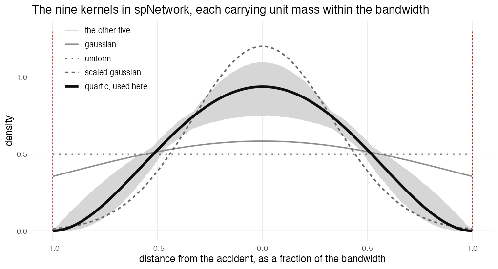
```

The quartic is used here for two reasons. It is the kernel the course chapter applies to its own worked example, so the results here are comparable with the material the course presents, and the `spNetwork` vignette recommends it (Gelb, 2021). Its support is compact and bounded by the bandwidth, which suits the hard cutoff the conditions above require.

The choice is not consequential on this dataset, and it is worth being explicit about why it goes untested. Yin (2020), the Lesson 2 reading on kernels and density estimation, notes that a density estimate varies with both the kernel function and the bandwidth, the bandwidth having the greater effect. The checks in @sec-estimators and @sec-bandwidth follow that order of importance. They compare the three estimators and they vary the bandwidth, and they leave the kernel at the quartic.

## The three network estimators {#sec-estimators}

`spNetwork` implements three network kernel density estimators, the simple form from Xie and Yan (2008) and the two corrected forms from Okabe et al. (2009), collected in Okabe and Sugihara (2012). Gelb (2021) calls the *simple* estimator biased and not a true kernel, because it does not conserve mass where the network branches, and Gelb and Apparicio (2023) measure the effect at an additional 84% of the mass at intersections. The *discontinuous* and *continuous* estimators both correct this.

The lecture slide defends the simple form twice: it is a quick way to look at a large dataset, and it suits a reading of the kernel as a distance-decaying function, in which intersections need not divide the mass. Neither defence reaches this surface: speed does not bear on a single reported result, and @sec-density-scale reads the surface as a density whose mass sums to *n*, so conservation is what makes those values interpretable.

::: callout-note
## Why the estimators differ

A kernel spreads its mass along the network from each accident. At a junction the simple estimator copies that mass onto every outgoing segment instead of dividing it, so a multi-way junction accumulates more density than the accidents themselves justify. The corrected forms divide it instead: the discontinuous estimator splits the mass at each node, which conserves it but leaves a step in the surface, and the continuous estimator divides it in a way that keeps the surface smooth.
:::

```{r}
#| label: fig-nkde-estimators
#| out-width: "100%"
#| echo: false
#| fig-cap: "Schematic. One accident's kernel reaching a junction where the road branches three ways. The simple estimator copies the mass into each branch, so the junction adds density the accident does not justify. The discontinuous estimator divides it into thirds, which conserves the mass and leaves a step. The continuous estimator divides it and adjusts the profile before the junction so the two meet smoothly."
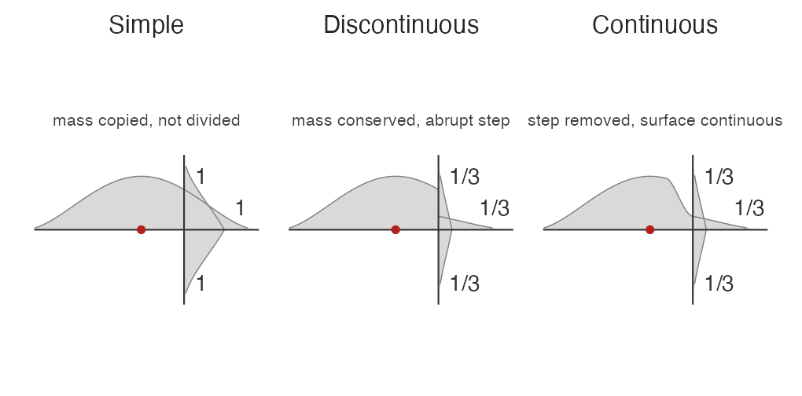
```

The call below is the one used, with the `method` argument that selects the estimator.

```{r}
#| label: nkde-call
#| eval: false
densities <- nkde(network,
             events      = accidents,
             w           = rep(1, nrow(accidents)),
             samples     = samples,
             kernel_name = "quartic",
             bw          = 400,
             div         = "bw",
             method      = "discontinuous",
             digits = 1, tol = 1, agg = 5,
             grid_shape = c(3, 3), max_depth = 8,
             sparse = TRUE, verbose = FALSE)

samples$density <- densities
lixels$density  <- densities
```

Running all three estimators on the same input at `bw = 400` gives closely agreeing surfaces.

```{r}
#| label: estimator-sensitivity
#| eval: false
map_dbl(c("simple", "discontinuous", "continuous"), function(m) {
  d <- nkde(network, events = accidents, w = rep(1, nrow(accidents)), samples = samples,
            kernel_name = "quartic", bw = 400, div = "bw", method = m,
            digits = 1, tol = 1, agg = 5, grid_shape = c(3, 3),
            max_depth = 8, sparse = TRUE, verbose = FALSE)
  cor(d, densities)
})
```

Each estimator was run on the same input at 400 m and compared against the other two.

```{r}
#| label: estimator-agreement
read_csv("data/derived/estimator_agreement.csv", show_col_types = FALSE) |>
  kable(col.names = c("Pair", "Correlation", "Top 50 lixels shared"))
```

The three surfaces agree closely, so the estimator is a sensitivity check on this dataset. The recursion was stopped at depth 8, against a default of 15 and the depth of 16 the slide gives for the continuous form, so the agreement above is a lower bound. The continuous estimator's values depend on that depth, because it corrects backwards through each junction, while the discontinuous form is exact at any depth. The discontinuous estimator is therefore the one used.

## Bandwidth selection {#sec-bandwidth}

::: callout-note
## The bandwidth

**What it is.** Each accident's kernel spreads its mass a fixed distance along the network: the bandwidth is where that influence reaches zero. It sets the scale of the pattern the surface shows. A short bandwidth resolves individual junctions and leaves most of the network at zero; a long one averages across whole corridors.

```{r}
#| label: kernel-bandwidth
#| fig-height: 3.2
#| echo: false
# Schematic of one accident's kernel along a network, at the 400 m bandwidth used here.
bw <- 400
d  <- seq(-700, 700, length.out = 601)
k  <- ifelse(abs(d) < bw, 1 - (d/bw)^2, 0)

ggplot() +
  geom_ribbon(aes(d, ymin = 0, ymax = k), fill = "grey84") +
  geom_line(aes(d, k), colour = "grey30", linewidth = 0.6) +
  annotate("segment", x = -700, xend = 700, y = 0, yend = 0, colour = "grey20", linewidth = 0.8) +
  annotate("segment", x = -bw, xend = bw, y = 0, yend = 0, colour = "grey15", linewidth = 2.4) +
  annotate("segment", x = c(-bw, bw), xend = c(-bw, bw), y = 0, yend = 1.06,
           linetype = "22", colour = "firebrick", linewidth = 0.5) +
  annotate("segment", x = 0, xend = bw, y = -0.30, yend = -0.30, colour = "grey30",
           arrow = arrow(ends = "both", length = unit(0.06, "in"))) +
  annotate("text", x = bw/2, y = -0.44, label = "bandwidth", size = 3.6, colour = "grey25") +
  annotate("point", x = 0, y = 0, colour = "firebrick", size = 2.8) +
  annotate("text", x = 0, y = -0.13, label = "accident", size = 3.6, colour = "grey25") +
  annotate("text", x = 0, y = 1.13, label = "mass carried by this accident",
           size = 3.6, colour = "grey35") +
  annotate("text", x = c(-bw, bw), y = 1.19, label = "influence\nfalls to zero",
           size = 3.0, colour = "firebrick") +
  scale_x_continuous(breaks = c(-bw, 0, bw), labels = c("-400", "0", "400")) +
  labs(x = "distance along the network (m)") +
  coord_cartesian(ylim = c(-0.52, 1.34)) +
  theme_minimal(base_size = 12) +
  theme(panel.grid = element_blank(), axis.text.y = element_blank(),
        axis.title.y = element_blank())
```

**How it is chosen.** Cross-validation likelihood, the selector `spNetwork` provides (Gelb and Apparicio, 2023), scores each candidate bandwidth on how well it predicts every accident from the others, and returns the value that scores highest.
:::

Cross-validation likelihood was run from 200 m to 8,000 m.

```{r}
#| label: cv-bandwidth
#| eval: false
bw_scores <- bw_cv_likelihood_calc(
  bws      = seq(200, 8000, 200),
  lines    = network, events = accidents, w = rep(1, nrow(accidents)),
  kernel_name = "quartic", method = "discontinuous",
  max_depth = 8, digits = 1, tol = 1, agg = 5, sparse = TRUE,
  grid_shape = c(3, 3), sub_sample = 1, verbose = FALSE, check = FALSE)
```

```{r}
#| label: cv-curve
#| fig-height: 3.6
cv <- read_csv("data/derived/cv_bandwidth_full.csv", show_col_types = FALSE)

ggplot(cv, aes(bandwidth_m, cv_score)) +
  geom_line(colour = "grey30") +
  geom_point(size = 0.7, colour = "grey30") +
  scale_x_continuous(labels = scales::comma) +
  labs(x = "bandwidth (m)", y = "cross-validation score") +
  theme_minimal(base_size = 12)
```

The score rises monotonically to about 2,000 m and then flattens, staying between −30.7 and −30.1 from 5,400 m onward. The highest value on the grid, −30.07 at 7,200 m, lies inside that flat region, and a bandwidth that size would smooth across the whole metropolitan region. The criterion identifies no bandwidth: it prefers as much smoothing as it is allowed.

The bandwidth is therefore chosen on substantive grounds. Road-safety interventions such as junction redesign, signal retiming and enforcement operate over a few hundred metres, so **400 m** is used. The network's own scale agrees: its 23,189 segments run a median of 116 m and a mean of 316 m, so 400 m spans between one and four of them, and Al-Aamri et al. (2021) place the urban range for this choice between 20 m and 1,000 m. To check that the corridor ranking does not rest on that choice, the surface was recomputed at 200 m and 800 m: **both retain 11 of the top 12 corridors**. The two that change are the lowest-ranked pair, replaced by unnamed roads carrying only a route number, so the ranking of named corridors is stable across a fourfold range of bandwidth. The comparison of the three estimators likewise finds the surface insensitive to which of them is used.

Tonini et al. (2017) take the bandwidth instead from the distance at which the spatio-temporal K function shows most clustering. That route has nothing to read on this network, because the K function increases monotonically over the range evaluated, from 7,154 at 200 m to 48,263 at 2,000 m, so it has no interior maximum to take a scale from.

```{r}
#| label: bandwidth-sensitivity
#| eval: false
# Recompute the surface at each bandwidth and re-rank the corridors.
rank_corridors <- function(bw) {
  d <- nkde(network,
            events      = accidents, w = rep(1, nrow(accidents)),
            samples     = lines_center(lixels),
            kernel_name = "quartic", bw = bw, div = "bw", method = "discontinuous",
            digits = 1, tol = 1, agg = 5, grid_shape = c(3, 3),
            max_depth = 8, sparse = TRUE, verbose = FALSE)

  lixels$density <- d
  lixels |>
    st_drop_geometry() |>
    filter(!is.na(road_name)) |>
    group_by(road_name) |>
    summarise(peak = max(density), .groups = "drop") |>
    arrange(desc(peak)) |>
    head(12) |>
    pull(road_name)
}

map(c(200, 400, 800), rank_corridors)
```

::: callout-note
## How this differs from the course chapter

Same sequence, four parameters changed.

|   | Chapter 7 | Here | Why |
|----------------|----------------|----------------|--------------------------|
| Lixel length | 700 m | 200 m | 700 m is longer than the 300 m bandwidth it pairs with, so it samples more coarsely than it smooths. 200 m is half our bandwidth, and splits 37.5% of the network's segments |
| Estimator | `simple` | `discontinuous` | The chapter gives no reason for `simple`; the slide offers two, and neither reaches this surface (@sec-estimators). Gelb (2021) says it multiplies mass at junctions, so it is not a true density function. Both corrected forms conserve mass; the continuous one needs its recursion near depth 16 before its values are exact, and this run stops at 8, where the discontinuous form is exact at any depth |
| Bandwidth | 300 m, fixed | 400 m, selected | 300 m is hard-coded and all seven of the package's selectors go unused. The selector finds no optimum here, so 400 m follows from the scale interventions work at |
| Grid shape | `c(1, 1)` | `c(3, 3)` | The chapter evaluates each lixel as a single grid cell; ours subdivides it three by three, which resolves the kernel more finely inside the lixel and costs some run time |

Kept as the chapter has them: the quartic kernel, `div = "bw"`, snapping before measuring. `max_depth` is lowered to 8 from the default of 15, which if anything understates the agreement above.
:::

## The density surface and its scale {#sec-density-scale}

This section reports the estimated surface and establishes what its values are. Gelb and Apparicio (2023) define the estimator with a 1/h leading factor, which fixes the scale of everything it returns. The course chapter applies that scale when it converts the values to a per-kilometre reading. Here it is checked, because a value read at the wrong scale changes every statement the surface supports.

The intensity surface is estimated with the discontinuous estimator at a 400 m bandwidth, on 46,110 lixels of about 159 m each.

```{r}
#| label: nkde-summary
tibble(n_lixels = nrow(lixels),
       named  = sum(!is.na(lixels$road_name)),
       pct_named = round(100 * mean(!is.na(lixels$road_name)), 1),
       zero_density = sum(lixels$density == 0)) |> kable()
```

- **46,110 lixels** are the sampling points, one for each 159 m of network, so the surface has no reading finer than a lixel.
- **82.1% of them carry a road name**, which is what allows the corridor ranking in the next subsection to name roads at all.
- **36,508, or 79.2%, return a density of zero.** With 3,599 accidents across 7,329 km of network, most of the network lies further than 400 m along the roads from any accident, and a zero states only that no accident lies within the bandwidth.

The surface is therefore sparse. Without an exposure measure, a rate per kilometre cannot separate a hazardous road from a busy one, so the surface is reported as a relative intensity with the segments ranked against one another.

::: callout-note
## Density scale

If the leading factor is 1/h, then density summed against lixel length should equal n/h.

```{r}
#| label: units-test
lx_len <- as.numeric(st_length(lixels))
total   <- sum(lixels$density * lx_len)
tibble(
  quantity = c("sum(density x lixel length)", "n / h", "ratio"),
  value = c(round(total, 4), round(nrow(accidents) / 400, 4),
            round(total / (nrow(accidents) / 400), 4))) |>
  kable()
```

Summing density against lixel length gives **8.976** against an expected n/h of **8.998**, a ratio of 0.9976.

| Test                                   | Result     |
|----------------------------------------|------------|
| sum(density x lixel length), h = 400 m | 8.976      |
| n / h, where n = 3,599                 | 8.998      |
| ratio                                  | **0.9976** |

The 0.24% shortfall is edge loss, kernel mass falling beyond the network boundary. It grows with bandwidth, measured at 0.90 for h = 900 m on a small test network. On a 7,329 km network at 400 m it is negligible.

The surface can therefore be converted to a count by multiplying by the bandwidth. Sections below report it as a relative intensity.
:::

## Corridors by peak intensity {#sec-corridors-peak}

The lixels are grouped by road name, and each corridor is represented by the highest value the surface reaches anywhere along it. Aggregating to the named road is what makes the surface usable: an intervention is designed for a stretch of road, and no authority acts on a lixel. Peak density then locates the point along that road where accidents concentrate most. Al-Aamri et al. (2021) summarise their surface in a coarser unit in the same way, summing network density over zones and ranking those; the unit here is the named road and the summary is its peak. The corridors named below appear as the darkest stretches of the classified surface in @sec-density-map.

```{r}
#| label: top-corridors
lixels |>
  st_drop_geometry() |>
  filter(!is.na(road_name)) |>
  group_by(road_name, rdcls) |>
  summarise(peak_density = signif(max(density), 3),
            n_lixels = n(), .groups = "drop") |>
  arrange(desc(peak_density)) |>
  head(12) |>
  kable(col.names = c("Corridor", "Road class", "Peak density", "Lixels"))
```

Peak density has limits the table cannot show.

- **The measure favours long corridors.** A longer road offers more points at which to reach a high value, so a ranking by peak is not a ranking by rate.
- **The ranking depends on the measure chosen.** Ordering the same corridors by accident count or by fatality count gives different orders, which @sec-corridor-ratio and the integration section take up.

The stability of the density ranking against the bandwidth is tested in @sec-bandwidth, and against the lixel length: the same twelve corridors appear at 100 m and 400 m as at 200 m.

## Corridor accidents against class expectation {#sec-corridor-ratio}

The ranking above uses peak density. Research question 1 also asks whether the concentration survives once road classes are accounted for. The expected count of a corridor is the sum over its segments of segment length times the class rate:

$$E_c = \sum_{s \in c} \ell_s\, r_{\mathrm{cls}(s)}$$

where $\ell_s$ is the length of segment $s$ and $r$ the accidents per kilometre of its road class, both computed from the dataset. The ratio of observed to expected is then the corridor's excess over what its classes and length predict.

Reading observed against expected in this way is the standardised ratio, long used for rates that vary with a population at risk. O'Sullivan and Unwin (2010, chapter 3) define it as the events in a zone against those expected from an external set of rates, and Fischer and Getis (2010) give the general form, an expected count being exposure multiplied by a rate. The exposure here is road length and the rate is specific to each road class, where the usual form takes a population and one rate for the whole study area.

```{r}
#| label: corridor-ratio
cls_rate <- accidents |>
  st_drop_geometry() |>
  count(cls, name = "n_accidents") |>
  left_join(network |> st_drop_geometry() |> group_by(cls) |>
              summarise(km = sum(km), .groups = "drop"), by = "cls") |>
  mutate(per_km = n_accidents / km)

network |>
  st_drop_geometry() |>
  filter(!is.na(road_name)) |>
  left_join(cls_rate |> select(cls, per_km), by = "cls") |>
  group_by(road_name) |>
  summarise(expected = sum(km * per_km), .groups = "drop") |>
  left_join(accidents |> st_drop_geometry() |> filter(!is.na(road_name)) |>
              count(road_name, name = "observed"), by = "road_name") |>
  filter(observed >= 20) |>
  mutate(expected = round(expected, 1), ratio = round(observed / expected, 2)) |>
  arrange(desc(ratio)) |>
  select(road_name, observed, expected, ratio) |>
  kable(col.names = c("Corridor", "Accidents", "Expected", "Ratio"))
```

::: callout-note
## Reading the ratio

Industrial Ring Road carries 121 accidents, over 13.81 km of primary road and 4.05 km of secondary.

| Road class | Length (km) | Rate per km | Expected accidents |
|------------|-------------|-------------|--------------------|
| Primary    | 13.81       | 0.2454      | 3.39               |
| Secondary  | 4.05        | 0.1575      | 0.64               |
| **Total**  | **17.86**   |             | **4.03**           |

Each expected count is that class's length multiplied by its rate, so the corridor's expectation is 4.03 accidents and the ratio of observed to expected is $121 / 4.03 = 30$. The road carries thirty times the accidents its classes and its length predict.

The two rates are regional averages: 507 accidents on 2,066 km of primary road and 407 on 2,584 km of secondary, across all six provinces. A corridor is therefore compared against every primary and secondary road in the region.
:::

Bangkok-Chonburi Motorway carries three times its expectation, while every expressway in the ranking above carries less than its expectation, on ratios of 0.39 for Sirat, 0.38 for Chalong Rat and 0.34 for Buraphawithi.

The two measures answer different questions:

- **Peak density**, the column that ranks the corridors in @sec-corridors-peak, locates the point along a corridor where accidents cluster, which is what an intervention at a junction or a merge area addresses.
- **The ratio**, the last column of the table above, describes the corridor's load against its class and length, which is the comparison between routes.

A long expressway can hold a dense local cluster and still carry fewer accidents per kilometre than its class average.

The ratio has limits the table cannot show:

- **It is indirect standardisation.** The class rates come from the same source, so a hazardous corridor cannot be differentiated from a heavily used one, which Limitation 1 sets out.
- **The expectation counts only the segments labelled with the corridor's name.** A corridor whose name appears on part of its length therefore has an understated expectation and an inflated ratio, and Industrial Ring Road's value is the most exposed to that.

::: callout-note
## What a partial name does to the ratio

Industrial Ring Road's 17.86 km of labelled segments give it an expectation of 4.03 accidents, and its 121 recorded accidents give it a ratio of 30. If the name covers only half of the corridor's real length, the expectation doubles to 8.06 and the ratio falls to 15. It would still lead the table, since the next corridor stands at 8.2, but the figure would halve.

Along Industrial Ring Road the label hands over to Rama III Road at the northern tip, to Suk Sawat Road in the west, and to unnamed ramps in the south, so the corridor is named in stretches with gaps between them. Across the whole network, 1,129 segments carry a highway number as their only name and 6,932 carry no road name at all.

```{r}
#| label: fig-road-naming
#| out-width: "100%"
#| echo: false
#| fig-cap: "The Industrial Ring Road as the network records it. The corridor's own name covers 17.86 km in 57 segments; where it stops, other names or no name take over."
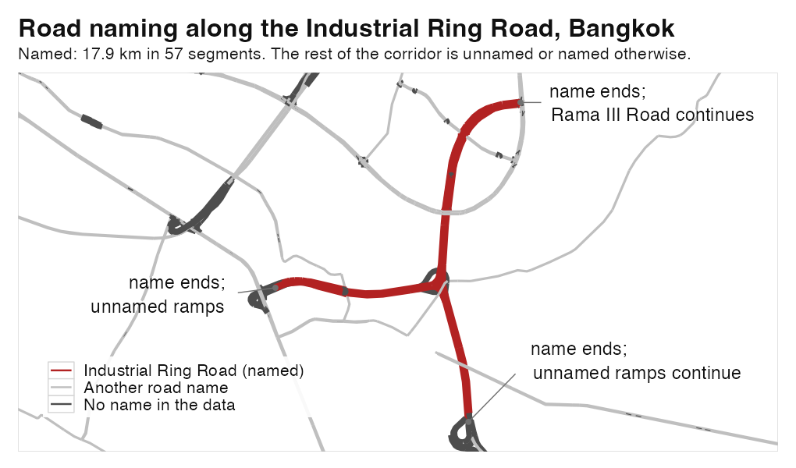
```

So 17.86 km is the length labelled Industrial Ring Road. Lengths are recorded per segment, with no figure for the road as a whole anywhere in the data.
:::

## Temporal network kernel density estimation

The second research question asks when intensity changes. Its within-day part is answered by adding a kernel over time to the estimator above, so that the density at a point on the network and an hour of the day becomes the product of a network kernel and a time kernel:

$$\lambda(u, t) = \frac{1}{bw_{net}\, bw_{time}}\sum_{i=1}^{n} w_i\, K_{net}(\mathrm{dist}(u, e_i))\, K_{time}(|t - t_i|)$$

Two bandwidths are required, one along the network and one in time, and Gelb and Apparicio (2023) define the estimator in this form. The run below keeps the 400 m network bandwidth of the static surface and adds a two-hour time bandwidth, the window the lesson's own worked example uses, with sampling points at every lixel centre and every hour of the day.

```{r}
#| label: tnkde-call
#| eval: false
tnkde(lines = network, events = accidents, time_field = "hour",
      w = rep(1, nrow(accidents)),
      samples_loc = lines_center(lixels), samples_time = 0:23,
      kernel_name = "quartic", bw_net = 400, bw_time = 2,
      adaptive = FALSE, method = "discontinuous", div = "bw",
      max_depth = 8, agg = NULL, sparse = TRUE, verbose = FALSE)
```

`agg` is left unset here, unlike the static surface, because it merges events that share a location and on a temporal estimate that would combine accidents from different hours.

```{r}
#| label: fig-tnkde-hour
#| out-width: "100%"
#| echo: false
#| fig-cap: "Temporal network density summed over the network by hour, with the densest corridor named."
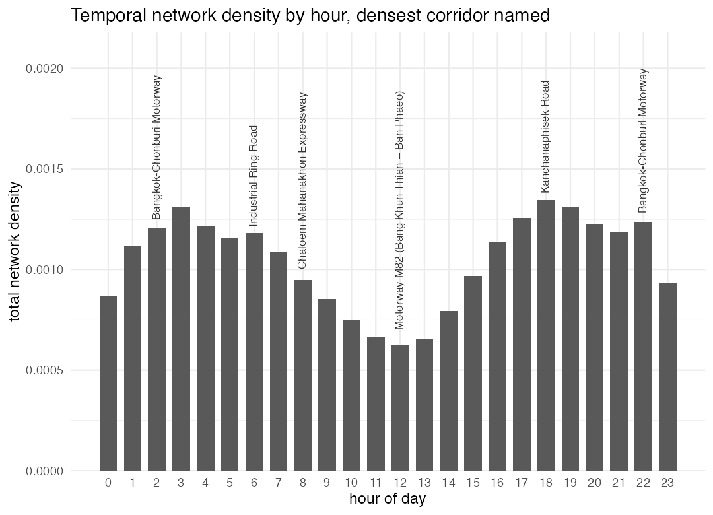
```

The densest location moves through the day:

- **20:00 to 03:00** Bangkok-Chonburi Motorway
- **04:00 to 07:00** Industrial Ring Road
- **08:00** Chaloem Mahanakhon Expressway
- **midday** Motorway M82
- **evening** Kanchanaphisek Road

```{r}
#| label: fig-tnkde-corridors
#| out-width: "100%"
#| echo: false
#| fig-cap: "The five corridors that hold the densest point on the network at some hour of the day, numbered to match the list above. Grey lines are the full road network."
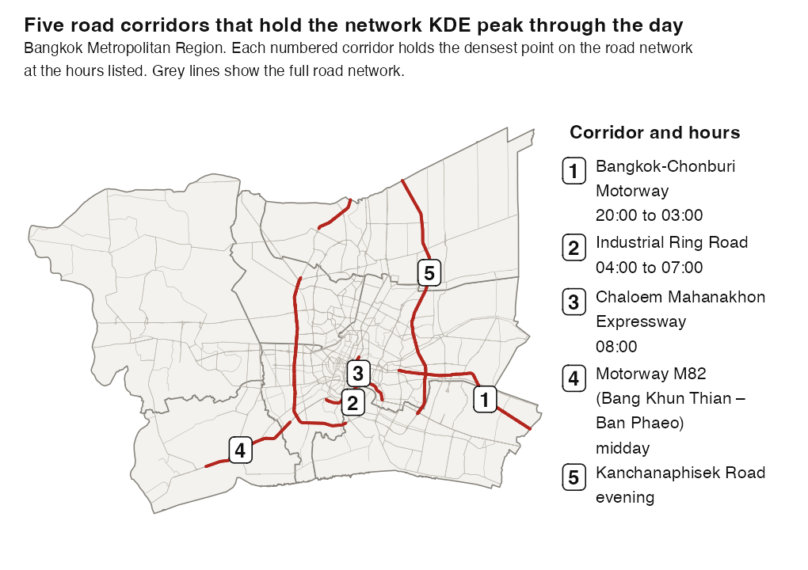
```

Density summed over the whole network peaks at 18:00, at 5.4% of the daily total, and again at 03:00, and is lowest between 12:00 and 14:00.

The estimate has limits that bear on the reading.

- **The day boundary.** The time kernel does not wrap around the day, so hour 00:00 receives nothing from 23:00 and its total runs 28.7% below the neighbouring hours.
- **Sparsity.** Only 17.9% of the network shows a non-zero density at any hour, since 3,599 events are spread over 7,329 km.
- **The time bandwidth is a choice.** The 02:00 corridor is the same at one, two and three hours. The 08:00 corridor is Chaloem Mahanakhon Expressway at one and two hours and Industrial Ring Road at three, where a three-hour kernel at 08:00 also carries the 05:00 to 07:00 window.
- **The figure sums over the network.** Each bar totals the density across all 46,110 lixels at that hour, so a single corridor's share of it cannot be read from the chart.

# Temporal variation in the record {#sec-temporal}

The second research question asks when intensity changes through the year. The method here follows the course's: events are aggregated over a chosen temporal unit and the periods are then compared, which the course leaves to the analyst and the lesson demonstrates by month for forest fires. The periods follow Iamtrakul and Chayphong (2025), who compare festival months against ordinary ones and daytime against night in these same six provinces. Their unit is the month, while the two windows used here are the dataset's own seven-day periods, so this section works at day resolution.

## Spatial signature of festival periods

The comparison follows Iamtrakul and Chayphong (2025), who analyse festival periods in these same six provinces. The fourteen festival days are not simply a busier version of the rest of the year. The road classes on which accidents occur change substantially.

```{r}
#| label: festival-class-shift
accidents |>
  st_drop_geometry() |>
  mutate(period = if_else(festival_window, "Festival", "Ordinary")) |>
  count(cls, period) |>
  group_by(period) |>
  mutate(share = round(100 * n / sum(n), 1)) |>
  select(-n) |>
  pivot_wider(names_from = period, values_from = share) |>
  mutate(ratio = round(Festival / Ordinary, 2)) |>
  arrange(desc(ratio)) |>
  kable(col.names = c("Road class", "Festival share", "Ordinary share", "Ratio"))
```

Motorway share roughly halves during festivals while secondary road share more than doubles. The provincial pattern shifts with it.

```{r}
#| label: festival-province-shift
total_festival  <- sum(accidents$festival_window)
total_ordinary  <- sum(!accidents$festival_window)

accidents |>
  st_drop_geometry() |>
  group_by(prov) |>
  summarise(n_accidents = n(), festival = sum(festival_window),
            festival_share = round(100 * sum(festival_window) / total_festival, 1),
            ordinary_share = round(100 * sum(!festival_window) / total_ordinary, 1),
            .groups = "drop") |>
  mutate(ratio = round(festival_share / ordinary_share, 2)) |>
  arrange(desc(ratio)) |>
  kable(col.names = c("Province", "Accidents", "Festival accidents",
                      "Festival share (%)", "Ordinary share (%)", "Ratio"))
```

Nonthaburi is 5.58 times over-represented during festival windows and Nakhon Pathom 2.97 times, while Bangkok falls to 0.69.

### Severity

```{r}
#| label: festival-severity
accidents |>
  st_drop_geometry() |>
  mutate(period = if_else(festival_window, "Festival, 14 days", "Ordinary, 351 days")) |>
  group_by(period) |>
  summarise(accidents  = n(),
            fatalities = sum(number_of_fatalities, na.rm = TRUE),
            per_100    = round(100 * sum(number_of_fatalities, na.rm = TRUE) / n(), 1),
            injuries   = sum(number_of_injuries, na.rm = TRUE),
            .groups = "drop") |>
  kable(col.names = c("Period", "Accidents", "Fatalities",
                      "Fatalities per 100 accidents", "Injuries"))
```

- **Fatality rate.** Festival accidents carry a fatality 3.4 times as often: 13.9 per 100 accidents against 4.1 in ordinary periods.
- **Vehicle mix.** Motorcycles are 9.3% of ordinary-period records and 33.4% of festival records.
- **Vehicle severity.** Motorcycles carry 21.4 fatalities per 100 records, against 2.4 for pickups and 2.1 for private cars. The window therefore shifts the mix towards the deadliest category in the dataset.
- **Road class.** The same shift moves away from motorways, which carry the lowest fatality rate of any class, towards trunk and primary roads at 13.2 and 10.1 per 100 accidents.

The windows are the dataset's own, so extending each by a day at either end was tested. The fatality ratio falls from 3.4 to 3.1, the motorcycle share from 33.4% to 29.8%, and the motorway share still roughly halves, so none of the three findings depends on where the window edge is drawn.

The festival concentration is documented for this region. Iamtrakul and Chayphong (2025) report sharp increases in April and December, and explain the provincial shift observed under severity: Bangkok peaks in December while the surrounding provinces peak in April, which they attribute to residents returning to their home provinces during holidays, lowering traffic in the capital while raising it elsewhere. Their finding accounts for the pattern here, where Bangkok falls to 0.69 of its ordinary share during festival windows while Nonthaburi rises to 5.58.

## Temporal variation by time of day

The day and night split follows the same reading, which compares the two for fatal and non-fatal crashes across this region.

```{r}
#| label: night
accidents_data <- accidents

accidents |>
  st_drop_geometry() |>
  mutate(period = if_else(night, "Night 22:00-05:00", "Day 05:00-22:00")) |>
  group_by(period) |>
  summarise(n_accidents = n(),
            pct_accidents = round(100 * n() / nrow(accidents_data), 1),
            fatalities = sum(number_of_fatalities, na.rm = TRUE),
            fatal_per_100 = round(100 * sum(number_of_fatalities, na.rm = TRUE) / n(), 1),
            .groups = "drop") |>
  mutate(pct_fatalities = round(100 * fatalities / sum(fatalities), 1)) |>
  kable()
```

Night accounts for 1,181 of the 3,599 accidents (32.8%) but 36 of the 177 fatalities (20.3%). The fatality rate is 3.0 per 100 accidents at night against 5.8 by day, so the more severe half of the day is the daylight one.

```{r}
#| label: hour-profile
#| fig-height: 4
hp <- accidents |> st_drop_geometry() |> group_by(hour) |>
  summarise(per100 = 100 * sum(number_of_fatalities, na.rm = TRUE) / n(), .groups = "drop")

ggplot(hp, aes(hour, per100)) +
  geom_col(fill = "grey35") +
  labs(x = "hour of day", y = "fatalities per 100 accidents",
       title = "Accident severity by hour, Bangkok Metropolitan Region, 2022") +
  theme_minimal()
```

### Severity within road classes

```{r}
#| label: night-by-class
accidents |>
  st_drop_geometry() |>
  group_by(cls, night) |>
  summarise(n = n(), per100 = round(100 * sum(number_of_fatalities, na.rm = TRUE) / n(), 1),
            .groups = "drop") |>
  filter(n >= 40) |>
  tidyr::pivot_wider(names_from = night, values_from = c(n, per100)) |>
  kable(col.names = c("Road class", "n day", "n night", "day per 100", "night per 100"))
```

::: callout-note
## Reading the table

- **Across a row** compares night with day inside one road class.
- **Down a column** compares road classes with one another within a period.
- `n day` and `n night` are accident counts; `per 100` is fatalities per 100 accidents.
- `NA` marks a period with fewer than 40 accidents, too few to give a rate.
- The rows are a subset: two classes fall below that threshold and are absent, so the `n` columns do not sum to the period totals.
:::

```{r}
#| label: night-class-share
accidents |>
  st_drop_geometry() |>
  mutate(period = if_else(night, "Night", "Day")) |>
  count(period, cls) |>
  group_by(period) |>
  mutate(share = round(100 * n / sum(n), 1)) |>
  filter(cls == "primary") |>
  select(period, share) |>
  kable(col.names = c("Period", "Primary roads, % of accidents"))
```

Severity is higher by day in every road class with enough observations to compare except motorway links, where the two rates differ by 0.1. The composition of the roads shifts, with primary roads carrying 14.8% of daytime accidents and 12.6% of night-time ones, which is too small a change to account for the 2.8-point gap.

```{r}
#| label: hour-bands
tot_fat <- sum(accidents$number_of_fatalities, na.rm = TRUE)
tot_acc <- nrow(accidents)

accidents |>
  st_drop_geometry() |>
  mutate(band = case_when(hour >= 6  & hour < 11 ~ "06:00-10:59",
                          hour >= 11 & hour < 16 ~ "11:00-15:59",
                          hour >= 16 & hour < 22 ~ "16:00-21:59",
                          TRUE                   ~ "22:00-06:00")) |>
  group_by(band) |>
  summarise(accidents      = n(),
            pct_accidents  = round(100 * n() / tot_acc, 1),
            fatalities     = sum(number_of_fatalities, na.rm = TRUE),
            pct_fatalities = round(100 * sum(number_of_fatalities, na.rm = TRUE) / tot_fat, 1),
            per_100        = round(100 * sum(number_of_fatalities, na.rm = TRUE) / n(), 1),
            pct_motorcycle = round(100 * mean(grepl("motorcycle", vehicle_type,
                                                    ignore.case = TRUE), na.rm = TRUE), 1),
            .groups = "drop") |>
  kable()
```

The four bands split where the hourly profile turns: the morning rise ends at 11:00, the afternoon decline at 16:00, and the evening floor at 22:00. Read against that profile, they place the severity more precisely than a night and day split does. The 06:00 to 11:00 band holds 703 accidents, 19.5% of the total, and 77 fatalities, 43.5% of all deaths, a rate of 11.0 per 100. The 16:00 to 22:00 band holds the most accidents, 1,039 or 28.9%, and the fewest deaths relative to its size, 23 or 13.0%, a rate of 2.2 per 100. Severity declines from morning to evening and rises only slightly overnight.

Motorcycle involvement points the same way without accounting for the pattern. Motorcycles are 13.4% of records in the 06:00 to 11:00 band and 12.6% overnight, yet the rates are 11.0 and 3.3 per 100. The same vehicle type at a similar share produces very different severity at the two times, so the recorded vehicle mix does not by itself explain the morning concentration.

Iamtrakul and Chayphong (2025) analysed 31,687 crashes in the same six provinces from 2012 to 2021 and found fatalities concentrated at night, 62.04% of fatal cases, with daytime carrying the majority of crashes at 56.73%. The pattern here runs the other way on both counts: 79.7% of fatalities fall in the daylight half, and that half is the more severe per accident. The two analyses cover the same region and differ in method, in period and in the treatment of time, since theirs is an areal autocorrelation of a decade of records and this is a network point process on a single year. Which of those differences produces the reversal is not settled here.

# Second-order spatial point pattern analysis {#sec-second}

The first order established where accidents are dense. It cannot say whether those locations influence one another, because a busy stretch of road and a clustering one produce the same surface, which @sec-rationale sets out. The second-order test answers that question, by comparing the distances between accidents against the distances a null model produces, and the question it answers is separate from the one the density surface answers.

The instrument is the network K function, because the events are confined to the road network. A planar K function measures straight-line distance, which would pass over ground where no accident can occur, and would treat as neighbours pairs of roads connected only off the network. Al-Aamri et al. (2021) use the network form on road traffic crashes and reject the planar one for that reason.

This section keeps the course chapter's instruments, the network K and G functions tested against a simulation envelope. Two things the test needs are produced here: tied coordinates displaced, which @sec-prep requires before any distance-based method is applied, and a rate for each road class, because the null is weighted by it. Where it departs is the null. The chapter's null is uniform along the network, and that is replaced here by the population-adjusted form of Hohl et al. (2017) and González and Moraga (2023), weighted by road class because a road network has no resident population to weight by, and because the traffic volume that would serve as exposure, though published for these roads, cannot be joined to them, as Limitation 1 sets out.

## Displacing tied coordinates {#sec-jitter}

Exact coordinate ties inflate short-range K without limit. Baddeley et al. (2015) describe duplicated coordinates as common and as severely affecting procedures built for simple point processes, and give perturbation as the remedy. A five-metre random displacement is applied here, of the same order as the four-metre median distance between an accident and the network, so it preserves the network constraint while breaking the ties.

```{r}
#| label: jitter-ties
#| eval: false
set.seed(1234)
acc_jittered <- st_jitter(accidents, amount = 5)

c(before = sum(duplicated(st_coordinates(accidents))),
  after  = sum(duplicated(st_coordinates(acc_jittered))))
```

The effect on the observed K function is confined to the shortest distance. In the Bangkok province subset, K at zero distance falls from 557.5 to 2.0, a 99.6% reduction, and moves from far outside the simulation envelope to inside it. At 200 m and beyond the change is under 20%. The earlier apparent clustering at zero distance was an artefact of repeated coordinates.

::: callout-note
## Why ties matter to K

The K function counts pairs of accidents falling within each distance. Two accidents at one coordinate sit zero metres apart, so that pair is counted at every distance from the first step onward. The number of neighbours at short distances therefore rises with the number of ties, whatever the pattern underneath, and duplication alone can push K past any envelope.

Displacing the tied coordinates by a few metres removes the effect. Five metres is used here, at the scale of the four-metre median distance from an accident to the network, so the displacement stays small enough to leave the network constraint intact.
:::

## Test of the default null model {#sec-default-null}

```{r}
#| label: chisq
cls_km <- network |> st_drop_geometry() |> group_by(cls) |>
  summarise(km = sum(km), .groups = "drop")
cls_n  <- accidents |> st_drop_geometry() |> count(cls, name = "n_accidents")
chisq_in <- left_join(cls_n, cls_km, by = "cls") |>
  mutate(expected = round(nrow(accidents) * km / sum(km), 1))

ct <- chisq.test(chisq_in$n_accidents, p = chisq_in$km / sum(chisq_in$km))

kable(chisq_in |> select(cls, n_accidents, km, expected) |> arrange(desc(n_accidents)),
      col.names = c("Road class", "Observed", "Network (km)", "Expected if uniform"))

tibble(statistic = round(unname(ct$statistic)),
       df        = unname(ct$parameter),
       p_value   = format.pval(ct$p.value, digits = 3)) |> kable()
```

The null tested here is the course chapter's own default, simulated accidents distributed uniformly along the network, which is the envelope the lesson demonstrates and the one Al-Aamri et al. (2021) test complete spatial randomness against. Both use a 5% envelope, and so does this. The number of simulations sets how finely the envelope is resolved and leaves its edges where they are, which is why the count below differs from the chapter's without changing the reading. The uniform null assumes accidents fall in proportion to road length. Tested directly, that assumption is rejected: motorway carries about 4.7 times the accidents the null predicts, and secondary roads about a third. A K-function test against this null will reject at every distance for reasons that have nothing to do with interaction between accidents.

::: callout-note
## What the chi-square test does

The uniform null holds that accidents fall in proportion to road length, so each road class should take a share of them equal to its share of the network. The test compares the accidents observed in each class against that share, and a large result means the spread across classes is further from proportional than chance allows.

O'Sullivan and Unwin (2010, chapter 5) put the same test to quadrat counts for the same purpose, testing a pattern against complete spatial randomness, and note that it needs an adequate expected count in every class. The smallest expected count here is 37.
:::

```{r}
#| label: fig-k-default
#| out-width: "100%"
#| echo: false
#| fig-cap: "Observed network K against the default uniform envelope, full region, 0 to 5 km."
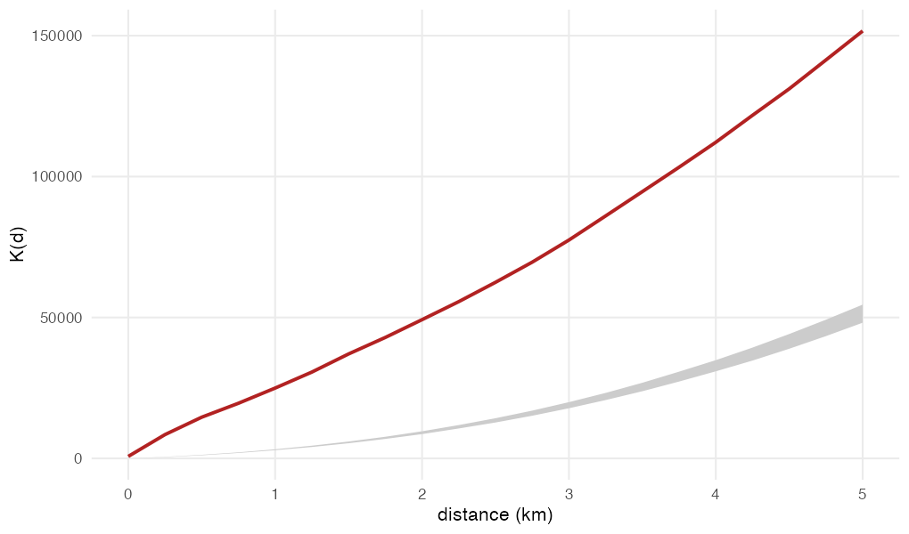
```

Run over the full region at 199 simulations, observed K lies above the upper envelope at all 21 distances, so the test rejects everywhere. That carries the same limitation as the chi-square above, and for the same reason: the null places accidents in proportion to length, while the observed rate per kilometre differs between road classes. The rejection is evidence against the uniform null.

## Accident rate by road class, for the class-weighted null

This rate is computed for one purpose. It supplies the class weights the second-order null draws from, and it settles whether the assumption the reference model makes is tenable. That model is set out in @sec-reference-model; the numbers it needs are produced here.

Nothing in the course material or the assigned readings computes a rate such as this. It is produced here because the weighted null below needs a weight for every road class, and no exposure measure can supply one, since the traffic volume published for these roads cannot be joined to them. Limitation 1 sets out why.

```{r}
#| label: class-rate
rate <- accidents |>
  st_drop_geometry() |>
  count(cls, name = "n_accidents") |>
  left_join(network |> st_drop_geometry() |> group_by(cls) |>
              summarise(km = sum(km), .groups = "drop"), by = "cls") |>
  mutate(per_km       = round(n_accidents / km, 3),
         pct_accidents = round(100 * n_accidents / sum(n_accidents), 1),
         pct_length    = round(100 * km / sum(network$km), 1)) |>
  arrange(desc(per_km))

kable(rate)
```

Motorway and trunk roads carry 65.0% of recorded accidents on 22.1% of network length. Including their link roads raises this to 71.7% of accidents on 28.9% of length. The rate ranges from 2.29 accidents per kilometre on motorway to 0.16 on secondary roads, a spread of roughly fifteen times.

The motorway rate is inflated by an unknown amount. The coordinates carry no height and Bangkok has tollways running directly above surface streets, so some street accidents are attributed to the expressway above them. The rate feeds two later results, and the inflated motorway figure reaches both: the class weights behind the null in @sec-classw, where the motorway weight is built from it and is therefore too large, and the expected counts behind the corridor ratios in @sec-corridor-ratio, where a motorway corridor's expectation is inflated for the same reason. @sec-prep sets out the ambiguity itself.

## Class-weighted null model results {#sec-classw}

The K function was run against 99 patterns drawn in proportion to each road class's own rate, with tied coordinates displaced, over the full six-province region.

A weighted null differs from the default in where the simulated accidents are placed. The default spreads them uniformly along the network, so a kilometre of secondary road is as likely to receive one as a kilometre of motorway. This null draws each simulated accident from the road classes in proportion to the rate they carry in the dataset, so motorway kilometres attract more of them and secondary kilometres fewer. Simulated patterns therefore already contain the road hierarchy, and any clustering the observed pattern shows beyond them is clustering the hierarchy does not explain.

```{r}
#| label: fig-null-comparison
#| out-width: "100%"
#| echo: false
#| fig-cap: "Where each model places its accidents, in a 16 by 7 km window on central Bangkok. Each panel draws as many points as the 176 accidents recorded in the window, and colours each point by the class of road it falls on. The observed pattern and the class-weighted null concentrate on motorway and trunk roads; the default null spreads across the whole network."
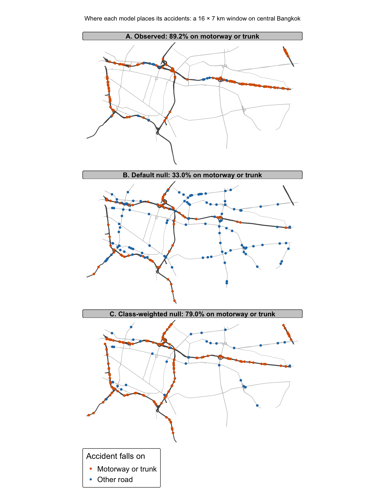
```

The two models separate as the observed composition requires. Across the whole region, 28% of the uniform null's simulated accidents fall on motorway or trunk roads and their links, against 71% of the class-weighted null's, and the dataset records 71.7% on those classes. The figure narrows to a 16 by 7 km window of central Bangkok, where those classes are 28.6% of the length and the three panels place 33.0%, 79.0% and 89.2% of their accidents on them.

The weighted null follows Hohl et al. (2017), who compare an observed K against population-adjusted simulations, and González and Moraga (2023), who set out when a null of this kind is required. Both weight by population; the weight here is the road class's own rate, since a road network has no resident population.

**The null does not remove within-region variation.** The class weights are estimated per road class across the whole region, so the null scatters accidents over all 7,329 km of network in proportion to length and class. It does not know that Bangkok carries more traffic per kilometre than Nakhon Pathom. Any concentration of accidents in the capital therefore inflates K at every distance, and part of the excess of observed K over the envelope comes from regional intensity variation. What separates the two explanations is how the excess changes with distance, which the table reports as a ratio.

```{r}
#| label: k-envelope-table
read_csv("data/derived/k_envelope_bmr.csv", show_col_types = FALSE) |>
  kable(col.names = c("Distance (m)", "Observed K", "Class-weighted upper",
                      "Ratio to class", "Default upper", "Ratio to default"))
```

```{r}
#| label: k-envelope-call
#| eval: false
kfun_accidents <- kfunctions(network, accidents_jittered,
                       start = 0, end = 2000, step = 200, width = 200,
                       nsim = 99, resolution = 100,
                       verbose = FALSE, conf_int = 0.05)
```

The envelope is built from 99 simulations, and the default null in the previous subsection from 199. The count sets the resolution of the envelope and the smallest attainable p-value, $1/(n_{sim}+1)$; with more simulations the envelope's own sampling variance also shrinks, so the edges settle. Neither run reports a p-value, because the finding rests on the ratio to the envelope falling with distance, which the count does not move. Both exceed the 50 the course chapter uses, which would cap the smallest attainable p-value at 0.0196. The two counts are not equalised with each other, and the result does not depend on which is used. One other argument differs from the chapter's call: `resolution` is 100 here against the chapter's 50, which splits the network into longer edges before simulated points are placed on it. No check here shows the coarser split changing the envelope.

```{r}
#| label: fig-k-nulls
#| out-width: "100%"
#| echo: false
#| fig-cap: "Observed network K against both envelopes, 200 m to 2 km. The observed curve sits above each envelope at every distance, and the class-weighted envelope lies above the uniform one, which is the between-class variation the weighting removes."
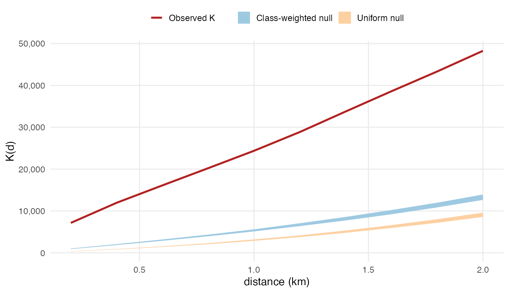
```

Observed K exceeds both envelopes at every distance from 200 m to 2 km, the range this run covers, where the default null above was run from 0 to 5 km. Against the class-weighted null the ratio falls steadily, from 6.92 at 200 m to 3.46 at 2 km. That decline is the finding: a concentration of traffic in Bangkok would inflate K by a similar factor at every distance, so an excess more than twice as large at 200 m as at 2 km is disproportionately short-range. Against the default null the ratio runs from 18.29 to 5.03 over the same range, which is the between-class variation the class-weighted null was introduced to remove.

Because K is cumulative, these distances are not independent tests. The result is one finding: there is excess clustering at a scale of a few hundred metres, and road class alone does not account for it. The pointwise envelope cannot say how often the whole curve would depart under the null, so the same simulations were put to a global rank envelope test. The observed curve takes the maximum rank at all 11 distances and exceeds every one of the 99 simulated curves, so the test gives p = 0.010, the smallest value 99 simulations can produce. The whole-curve reading and the pointwise one agree.

That scale has a counterpart in the network's geometry. Taking a junction as a point where three or more mapped roads meet, the median accident sits **192 m** from the nearest one, **half of all accidents fall within 200 m**, and two thirds within 400 m. The scale therefore describes how far accidents spread around a junction; on the retained major-road network the junctions themselves average about 1.4 km apart.

```{r}
#| label: junction-distance
junc <- st_cast(network[, "osm_id"], "POINT")
jco  <- st_coordinates(junc)
junc <- tibble(osm_id = junc$osm_id, x = jco[, 1], y = jco[, 2]) |>
  group_by(x, y) |>
  summarise(roads = n_distinct(osm_id), .groups = "drop") |>
  filter(roads >= 3) |>
  st_as_sf(coords = c("x", "y"), crs = st_crs(network))

jd <- st_distance(accidents, junc) |> apply(1, min) |> as.numeric()

tibble(junctions    = nrow(junc),
       network_km   = round(sum(network$km)),
       km_per_junction = round(sum(network$km) / nrow(junc), 2),
       median_m     = round(median(jd)),
       within_200_m = round(100 * mean(jd <= 200), 1),
       within_400_m = round(100 * mean(jd <= 400), 1)) |>
  kable(col.names = c("Junctions", "Network (km)", "km per junction",
                      "Median distance (m)", "Within 200 m (%)", "Within 400 m (%)"))
```

### The same test on the G function

K accumulates every pair within a distance, so its value at 2 km includes every pair that produced its value at 200 m. A short-range cluster therefore lifts the whole curve, and the curve alone cannot say at which scale the excess sits. The G function counts pairs in a ring, so its value at a distance depends only on the spacing at that scale. That is what makes it worth reporting: it tests whether the falling K ratio comes from short-range clustering or from the shape of the accumulation. `kfunctions()` returns both statistics, so the class-weighted envelope was computed for G in the same run.

```{r}
#| label: fig-g-class
#| out-width: "100%"
#| echo: false
#| fig-cap: "Observed network G against the class-weighted envelope, full region. Grey band, envelope; firebrick, observed."
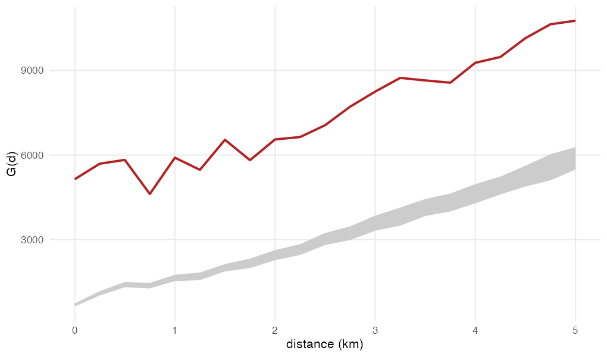
```

Observed G exceeds the class-weighted envelope at every distance tested, as K does, and its ratio to the envelope falls from **4.85 at 250 m to 1.71 at 5 km**. The G run covers 0 to 5 km at 250 m steps, wider than the K run in @sec-classw, and returns K on its own grid as well, so the two ratios can be read at the same distances.

```{r}
#| label: kg-ratio-table
read_csv("data/derived/k_g_envelope.csv", show_col_types = FALSE) |>
  kable(col.names = c("Distance (m)", "K ratio to envelope", "G ratio to envelope"))
```

Two statistics that count pairs differently agree on the shape of the result. Both ratios fall as distance grows, from 6.31 to 2.30 for K and from 4.85 to 1.71 for G, so the excess is concentrated at short range and the class-weighted null accounts for more of it as distance grows.

# Integrated findings and discussion {#sec-integration}

| Research question | Answer | Established in |
|------------------------|------------------------|------------------------|
| 1. Where does intensity concentrate, and does it persist once road types are accounted for? | Intensity concentrates on a small number of corridors, and the concentration survives the class-weighted null at every distance tested, so it is more than road-class composition produces | @sec-first, @sec-corridors-peak, @sec-corridor-ratio, @sec-classw |
| 2. When does intensity change through the year, and is the pattern stable across the region? | Fourteen festival days run at twice to three times the daily baseline and shift the mix away from motorways and out of Bangkok; within the day the severest band is 06:00 to 11:00 | @sec-temporal, @sec-first |
| 3. Do accidents cluster beyond what road hierarchy alone would produce? | Yes, and the excess falls with distance, which places it at short range | @sec-second, @sec-jitter, @sec-classw |

## Contribution of each analysis

The first-order estimate locates intensity. It concentrates on a small number of corridors, chiefly the Bangkok-Chonburi Motorway, the Industrial Ring Road, Motorway M82 and Kanchanaphisek Road, and falls away sharply elsewhere. The estimate does not say whether the concentration is more than the road hierarchy would produce.

The second-order test addresses exactly that. Against a null in which simulated accidents follow each road class's own rate, observed clustering remains 3.5 to 6.9 times the upper envelope from 200 m to 2 km. The null does not remove the concentration of traffic in Bangkok, so the inference rests on the ratio falling with distance, from 6.9 at 200 m to 3.5 at 2 km. Accidents concentrate at a scale of a few hundred metres beyond what road type explains, which is the distance at which accidents accumulate around junctions (@sec-classw).

The density surface and the K function therefore complement each other: the surface says where intensity peaks, and the K function says that the clustering at a few hundred metres is more than road class composition produces. The corridor ratios in @sec-corridor-ratio measure a third thing, the load each corridor carries against its class and length, and they place the clearest excess on different roads from the ones the surface ranks highest.

## Divergence between count and harm rankings

Both analyses rank by event count, and count is a poor guide to harm here.

- Bangkok-Chonburi Motorway is second by accident count and records one fatality in 591 accidents.
- Buraphawithi Expressway records a tenth as many accidents and five fatalities.
- **The 06:00 to 11:00 window holds a fifth of the accidents and 43.5% of the deaths.**

A count-based surface cannot see the third point, because it aggregates over the whole year and loses the time of day.

## Effect of the reporting artefact

@sec-repeat shows that 14.4% of accidents sit at 199 coordinates whose fatality rate is 0.6 per 100 against 5.7 elsewhere, and that contamination varies from 1.2% to 50.0% across the leading corridors. Part of what the intensity surface identifies is therefore recording practice. This does not invalidate the second-order finding, which concerns relative spacing, but it does mean the corridor ranking carries an unknown component of administrative geography.

## Alternative explanations considered

| Observation | Alternative explanation | Status |
|------------------------|------------------------|------------------------|
| Clustering beyond the class-weighted null | Within-class variation: junction density, traffic volume, lane count | **Not excluded.** The null removes only between-class differences |
| Festival severity gap | The window shifts the vehicle mix towards motorcycles | **Partly supported.** Motorcycles rise from 9.3% to 33.4% of records |
| Daytime severity gap | Daytime accidents occur on more dangerous road types | **Excluded.** The gap holds within every class except motorway links |
| Corridor intensity ranking | Recording practice at default coordinates | **Partly supported.** Contamination runs from 1.2% to 50.0% across the leading corridors, @sec-repeat |
| Second-half increase in accidents | Pandemic recovery in traffic volume, and the December festival window | Both present, and the data cannot separate them |

# Geovisualisation and geocommunication {#sec-geovis}

## Spatial distribution of recorded accidents

```{r}
#| label: map-overview
#| fig-height: 7
tmap_mode("plot")
tm_shape(boundary) + tm_polygons(fill = "grey95", col = "grey60") +
  tm_shape(network) + tm_lines(col = "grey75", lwd = 0.3) +
  tm_shape(accidents) + tm_dots(fill = "firebrick", size = 0.05, fill_alpha = 0.4) +
  tm_title("Recorded accidents and the major road network, Bangkok Metropolitan Region, 2022") +
  tm_layout(frame = FALSE)
```

The accidents cluster along the Kanchanaphisek ring and the radial expressways, with a visible concentration in the south-east toward Samut Prakan. Large parts of Nakhon Pathom and Pathum Thani carry network but few recorded events, which is consistent with the reporting bias noted in the limitations.

## Classification of the density surface {#sec-density-map}

Density on this network is extremely unevenly distributed. Of 46,110 lixels, **36,508 (79.2%) carry zero density**, and the positive values span almost nine orders of magnitude. A continuous colour scale allocates colour in proportion to value, so the bottom 95% of segments falls into the first sliver of the ramp and the map renders almost uniformly pale.

Quantile classification does not solve this either: with such a large spike at zero, five of the six quantile breaks land on zero, and its seven classes collapse to two.

::: callout-note
## Classification method

**Jenks natural breaks** is an iterative method that places the class boundaries where the values group apart, so that each class holds similar segments and neighbouring classes differ as much as the values allow. It minimises the variance within each class and maximises the variance between classes.
:::

```{r}
#| label: break-comparison
# Jenks samples its breaks when n is large, so the seed is set here to fix them and the
# same breaks are handed to the map below.
set.seed(1234)
jenks <- classInt::classIntervals(lixels$density, 7, style = "jenks")
quant <- classInt::classIntervals(lixels$density, 7, style = "quantile")
jenks_brks <- jenks$brks

populated <- function(ci) { tb <- table(findCols(ci)); tb[tb > 0] }

tibble(
  method    = c("Quantile, 7 classes", "Jenks, 7 classes"),
  populated = c(length(populated(quant)), length(populated(jenks))),
  sizes     = c(paste(populated(quant), collapse = ", "),
                paste(populated(jenks), collapse = ", "))) |>
  kable(col.names = c("Method", "Classes populated", "Lixels per class"))
```

Jenks spends its breaks where the variation actually is. The first class absorbs the cold network and every remaining class is populated, from 3,419 lixels down to 84.

```{r}
#| label: map-density
#| fig-height: 6
peaks <- lixels |>
  filter(!is.na(road_name)) |>
  group_by(road_name) |>
  slice_max(density, n = 1, with_ties = FALSE) |>
  ungroup() |>
  arrange(desc(density)) |>
  slice_head(n = 6) |>
  mutate(lab = sub(" \\(.*", "", road_name))
st_geometry(peaks) <- st_centroid(st_geometry(peaks))

tm_shape(boundary) + tm_polygons(fill = "grey98", col = "grey70") +
  tm_shape(lixels) +
  tm_lines(col = "density", lwd = "density",
           col.scale = tm_scale_intervals(
             style = "fixed", breaks = jenks_brks,
             values = c("grey93", "#FFEDA0", "#FEB24C", "#FD8D3C",
                        "#F03B20", "#BD0026", "#67001F")),
           lwd.scale = tm_scale_intervals(
             style = "fixed", breaks = jenks_brks,
             values = c(0.3, 1.9, 2.1, 2.3, 2.5, 2.7, 3.0)),
           col.legend = tm_legend(title = "Network density", reverse = TRUE),
           lwd.legend = tm_legend(show = FALSE)) +
  tm_shape(peaks) +
  tm_text("lab", size = 0.62, col = "grey5", fontface = "bold",
          bgcol = "white", bgcol_alpha = 0.85) +
  tm_title("Network kernel density of accidents, bandwidth 400 m") +
  tm_layout(frame = FALSE, legend.outside = TRUE, legend.outside.position = "right",
            legend.text.size = 0.8, legend.title.size = 0.9)
```

The strongest bands are the six corridors named on the map, each labelled where its own density peaks: the Bangkok-Chonburi Motorway to the east, the Industrial Ring Road and Motorway M82 to the south and south-west, Kanchanaphisek Road and the Don Mueang Tollway to the north, and the Sirat Expressway through the centre. The darkest class holds the 96 lixels with the highest density and corresponds to those corridors. Because the estimator returns a relative surface, colours rank segments against one another and carry no absolute rate.

## Festival over-representation by province

```{r}
#| label: map-festival
#| fig-height: 5.5
d_fest <- as.Date(accidents$incident_datetime)
fest <- (d_fest >= as.Date("2022-04-11") & d_fest <= as.Date("2022-04-17")) |
        (d_fest >= as.Date("2022-12-29")) | (d_fest <= as.Date("2022-01-04"))
tot_f <- sum(fest)
tot_o <- sum(!fest)

prov_ratio <- accidents |>
  st_drop_geometry() |>
  mutate(fest = fest) |>
  group_by(prov) |>
  summarise(ratio = sum(fest) / tot_f / (sum(!fest) / tot_o), .groups = "drop") |>
  mutate(ratio = round(ratio, 2),
         lab = sprintf("%s\n%.2f×", sub(" Province$", "", prov), ratio))

chor <- boundary |> left_join(prov_ratio, by = c("shapeName" = "prov"))

tm_shape(chor) +
  tm_polygons(fill = "ratio",
              fill.scale = tm_scale_intervals(style = "fixed",
                breaks = c(0, 0.8, 1.2, 3, 6),
                values = c("#4575B4", "#ABD9E9", "#FDAE61", "#D73027")),
              fill.legend = tm_legend(title = "Festival share ÷ ordinary share"),
              col = "grey45", lwd = 0.8) +
  tm_text("lab", size = 1.0, col = "grey10") +
  tm_title("Festival over-representation by province, 2022") +
  tm_layout(frame = FALSE)
```

A paired point map cannot carry this comparison. Fourteen days hold 296 accidents against 3,303 in the rest of the year, so the festival panel reads as empty beside the other one and hides the shift it is meant to show. The two shares are mapped instead, and their ratio is the finding: Nonthaburi takes 5.58 times its ordinary share of the festival windows and Nakhon Pathom 2.97, while Bangkok falls to 0.69. The road classes shift with it, onto primary and secondary roads, which @sec-temporal tabulates.

# Public-safety planning and management implications {#sec-planning}

## Supported planning implications

The morning peak is the largest single concentration of harm. The 06:00 to 11:00 window holds 703 accidents, 19.5%, and 77 of the 177 fatalities, 43.5%, a rate of 11.0 per 100. The 16:00 to 22:00 window holds more accidents than any other band, 28.9%, and the smallest share of deaths, 13.0%. Accident counts point deployment at the evening, deaths at the morning. The temporal density estimate locates that morning peak: **Industrial Ring Road holds the densest point on the network from 04:00 to 07:00**, having passed from the Bangkok-Chonburi Motorway at about 03:00, so a morning deployment has both a time and a corridor.

The two festival windows are the second lever. Fourteen days carry a fatality rate of 13.9 per 100 against 4.1 across the rest of the year. These dates are known a year ahead and already carry an enforcement campaign, though whether a changed campaign would reduce the toll is untested here.

The second-order result identifies a scale: clustering beyond road class peaks near 200 m, where half the accidents lie within that distance of a junction (@sec-classw). The dataset's location field points the same way, coding 126 records to an intersection, a grade-separated ramp, a merge lane or a U-turn area, against 3,030 to a straight road, and the junction group carries 12 fatalities, a higher rate per record. Only 2 records are coded to a U-turn area, where Thai practice treats the median opening as a leading crash location, so the field cannot confirm the junction reading on its own. Treatments at this scale, junction redesign, signal retiming and approach lighting, match the clustering.

## Constraints on spatial targeting

Ranking specific locations for treatment is not supported. The intensity surface cannot be read as a rate, 14.4% of accidents sit at coordinates that appear to be administrative, and no exposure measure is used here, so a busy road cannot be differentiated from a hazardous one. Naming corridors on this basis risks directing resources to where incidents are logged.

## Coverage limitations and vulnerable road users

Motorcycles are 406 of these 3,599 records, 11.3%, but carry **87 of the 177 fatalities, 49.2%**, and national figures put motorcycle drivers and passengers at **73% of Thai road deaths** (Nishi et al., 2018). The source is the Ministry of Transport's road-network dataset, whose `agency` column carries Department of Highways, Department of Rural Roads and Expressway Authority of Thailand roads only, so every Bangkok Metropolitan Administration, municipal and soi road lies outside it. Motorcyclists are the group that coverage omits, since they ride the excluded network, so any programme built on this analysis should be paired with a source that captures motorcycle casualties.

# Limitations {#sec-limitations}

1.  **Exposure is not measured.** Traffic volume for these roads is published, by the Department of Highways per control section for 2022, and it can neither be joined to this network nor cover it. Both the highways and the rural roads are identified by highway number and kilometre post, with no coordinates and no name matching OpenStreetMap, while these accidents carry an OSM id, an English street name and a road class. Matching on highway number reaches 803 of the 23,189 segments, and 126 of the 3,599 accidents, 3.5% of them; a further 362 accidents carry no road name at all. Coverage fails as well: the six provinces hold 117 count sections in total, 21 of them in Bangkok. And the join would be too coarse where it did succeed, since volume varies up to eightfold between control sections of one highway, so a highway average would misstate exposure by that much on the corridors this report names. The road-class section therefore uses accident rate per kilometre by road class, computed from the accidents themselves. Dividing density by that rate is indirect standardisation, and it cannot distinguish a genuinely hazardous road from a heavily used one.
2.  **The reference model removes only between-class variation.** Junction density, traffic volume and lane count vary within a single road class, so a first-order explanation for the residual clustering in the class-weighted null result is not fully excluded.
3.  **The null is composite.** The class weights are estimated from the observed accidents before the simulations are drawn. The pointwise envelope also carries no global error rate, so a global rank envelope test was applied to the same simulations and returns p = 0.010 for the whole curve. González and Moraga (2023) state that Monte Carlo envelopes become invalid when the null hypothesis is composite, which weakens the strength of the rejection even though its direction stands. That test is nominal under a composite null, so the two-stage form required when parameters are estimated before the simulations are drawn is the correction that remains. `kfunctions()` returns the simulated curves through `return_sims`, so the correction could be run without repeating the simulation.
4.  **The sample is selective, and the motorcycle share is understated.** 3,599 records and 177 fatalities understate the injury burden for a region of this size. Within the dataset motorcycles are 11.3% of records and 49.2% of fatalities. National figures put motorcycle drivers and passengers at **73% of Thai road deaths** (Nishi et al., 2018), rising to **84%** on integrated police, hospital and insurance data (Kanitpong et al., 2024). The dataset holds Ministry of Transport roads only, so the network motorcyclists use is largely outside it. The count itself is not anomalous for that coverage: Iamtrakul and Chayphong (2025) report 3,170 records a year for the same six provinces, close to the 3,599 here, which is what a dataset of this coverage yields.
5.  **Injury counts are not used.** Fatality counts appear in the festival, night, repeat-site and corridor comparisons, but injuries, which are recorded for every accident, are not analysed.
6.  **Elevated expressways** bias the road-class assignment, as @sec-prep sets out.
7.  **The dataset covers Ministry of Transport roads only.** Department of Highways, Department of Rural Roads and Expressway Authority per-kilometre rates are computed on the network those authorities own, and the excluded minor network is where much motorcycle and pedestrian trauma occurs.
8.  **Density is reported as relative intensity.** The scale factor between the returned values and a count is known and verified in the units callout, but the report ranks segments against one another and does not convert to absolute rates, because exposure is unavailable and the ranking is what the planning question requires.
9.  **Edge correction is not applied, in space or in time.** Accidents just outside the boundary are unobserved, so segments near the edge have artificially few neighbours (Baddeley et al., 2021). What follows from that differs by analysis.

    - **Density surface.** The correction was available and declined. `nkde()` takes a `diggle_correction` argument with a `study_area`, and @sec-density-scale measures the edge loss at 0.24% at a 400 m bandwidth.
    - **K test.** No such argument exists, and none is needed. The envelope is simulated on the same clipped network, so the missing neighbours bear on the observed pattern and on every simulated pattern alike and largely cancel in the ratio. Any residue is conservative, since truncation understates the observed K, which already exceeds the envelope at every distance tested.
    - **Time.** The time kernel does not wrap, so hour 00:00 receives nothing from 23:00 and its total runs 28.7% below the neighbouring hours.
10.  **The dataset states no timezone.** The timestamps carry no offset or zone marker and the source documentation does not give one, so they were read as Bangkok local time. The file itself offers no way to check that reading, since every field derived from the timestamp inherits it. Every time-of-day result depends on the assumption. Read as UTC instead, night and day exchange places and the severity finding reverses.
11.  **The year is not stationary.** Thailand relaxed its remaining COVID-19 controls during 2022, and recorded accidents rose as traffic recovered. The second half carries 33% more accidents than the first, so the two festival windows are the only seasonal contrast the data support. @sec-prep sets out the rise.

# Appendix: Data preparation code

The analysis sections read four derived layers from `data/derived/`. This appendix is the code that builds them. The accident dataset and the boundary file are committed under `data/rawdata/`. The four Overpass tiles are not committed, because they total 23 MB and are reproducible from the query below. The derived layers are committed, so every analysis chunk above runs from a clone without this appendix being executed.

## Raw inputs

``` bash
# Four Overpass tiles covering the Bangkok Metropolitan Region bounding box, 13.42 to 14.28 N, 99.80 to 100.97 E.
# Both public endpoints rate-limit, so the fetch alternates between them and retries.
i=0
for box in "13.42,99.80,13.86,100.39" "13.42,100.39,13.86,100.97" \
           "13.86,99.80,14.28,100.39" "13.86,100.39,14.28,100.97"; do
  i=$((i+1))
  curl -s -X POST https://overpass.kumi.systems/api/interpreter \
   --data-urlencode "data=[out:json][timeout:540];
way[\"highway\"~\"^(motorway|motorway_link|trunk|trunk_link|primary|primary_link|secondary|secondary_link)\$\"]($box);
out geom;" -o "bmr_t$i.json"
done
```

## Study window

The six provinces are selected by name from the geoBoundaries ADM1 layer, held as six separate features, and unioned only where a single geometry is needed for an intersection test.

```{r}
#| label: prep-boundary
#| eval: false
keep <- c("Bangkok", "Nakhon Pathom Province", "Nonthaburi Province",
          "Pathum Thani Province", "Samut Sakhon Province", "Samut Prakan Province")

boundary <- st_read("data/rawdata/gb_THA_ADM1.geojson", quiet = TRUE) |>
  filter(shapeName %in% keep) |>
  st_transform(32647) |>
  st_make_valid()

bmr_u <- st_union(boundary)

st_write(boundary, "data/derived/bmr_boundary.gpkg", delete_dsn = TRUE, quiet = TRUE)
```

## Accidents

```{r}
#| label: prep-accidents
#| eval: false
raw <- read_csv("data/rawdata/thai_road_accident_2019_2022.csv", show_col_types = FALSE)

a <- raw |> mutate(year = lubridate::year(incident_datetime)) |> filter(year == 2022)
a <- a |> filter(!is.na(latitude), !is.na(longitude))

inTH <- a$latitude > 5.5 & a$latitude < 20.6 & a$longitude > 97.2 & a$longitude < 105.8
a <- a[inTH, ]

acc <- st_as_sf(a, coords = c("longitude", "latitude"), crs = 4326) |> st_transform(32647)
acc <- acc[lengths(st_intersects(acc, bmr_u)) > 0, ]

st_write(acc, "data/derived/bmr_accidents_2022.gpkg", delete_dsn = TRUE, quiet = TRUE)
```

## Network

```{r}
#| label: prep-network
#| eval: false
mk <- function(f) {
  d  <- fromJSON(f, simplifyVector = FALSE)$elements
  ln <- lapply(d, function(w) {
    g <- do.call(rbind, lapply(w$geometry, function(p) c(p$lon, p$lat)))
    if (is.null(g) || nrow(g) < 2) return(NULL)
    st_linestring(g)
  })
  k <- !sapply(ln, is.null)
  st_sf(osm_id = sapply(d[k], function(w) w$id),
        cls    = sapply(d[k], function(w) w$tags$highway),
        geometry = st_sfc(ln[k], crs = 4326))
}

rd <- do.call(rbind, lapply(sprintf("bmr_t%d.json", 1:4), mk))
rd <- rd[!duplicated(rd$osm_id), ]              # the tiles overlap at their seams

net <- rd |>
  st_transform(32647) |>
  st_intersection(bmr_u) |>
  st_collection_extract("LINESTRING") |>        # st_intersection returns MULTILINESTRINGs
  st_cast("LINESTRING")                         # and lixelize_lines inflates them silently
net <- net[as.numeric(st_length(net)) > 1, ]
net$km <- as.numeric(st_length(net)) / 1000

st_write(net, "data/derived/bmr_network.gpkg", delete_dsn = TRUE, quiet = TRUE)
```

## Derived fields

```{r}
#| label: prep-derive
#| eval: false
nr <- st_nearest_feature(acc, net)                            # sf
acc$snap_m    <- as.numeric(st_distance(acc, net[nr, ], by_element = TRUE))
acc$cls       <- net$cls[nr]                                  # road class of the nearest road
acc$road_name <- net$road_name[nr]                            # corridor of the nearest road

# n_at_site counts the accidents sharing a coordinate exactly.
xy  <- st_coordinates(acc)
key <- paste(xy[, 1], xy[, 2])
acc$n_at_site <- as.integer(table(key)[key])

# The dataset carries no timezone, and its timestamps are local civil time.
# force_tz() sets the zone without moving the wall clock, so the hour is read
# as written whatever zone the session is running in.
acc$incident_datetime <- lubridate::force_tz(acc$incident_datetime, "Asia/Bangkok")
acc$hour   <- lubridate::hour(acc$incident_datetime)          # lubridate
acc$night  <- acc$hour >= 22 | acc$hour < 5

st_write(acc, "data/derived/bmr_accidents_2022.gpkg", delete_dsn = TRUE, quiet = TRUE)
```

`snap_m` is the distance from each accident to the network it was matched against, and `cls` and `road_name` are the class and the name of the nearest road segment. `n_at_site` counts the accidents sharing a coordinate exactly. `hour` and `night` come from the dataset's own timestamp, with night defined as 22:00 to 05:00. `prov` is the dataset's province field.

The study window `bmr_u` is the union of the six geoBoundaries ADM1 province polygons, read from the geoBoundaries GeoJSON and transformed to EPSG:32647. The lixelisation and the bandwidth search are reported in the sections above.

# References {#sec-references}

Iamtrakul, P. and Chayphong, S. (2025). GIS-based analysis of spatio-temporal clustering of road traffic accidents in Bangkok Metropolitan Region (BMR), Thailand from 2012 to 2021. *Transportation Research Interdisciplinary Perspectives*, 31, 101489. <https://doi.org/10.1016/j.trip.2025.101489>

Gelb, J. (2021). spNetwork: A Package for Network Kernel Density Estimation. *The R Journal*, 13(2). <https://journal.r-project.org/articles/RJ-2021-102/>

Gelb, J. and Apparicio, P. (2023). Temporal Network Kernel Density Estimation. *Geographical Analysis*, 56(1), 62-78. <https://doi.org/10.1111/gean.12368>

Xie, Z. and Yan, J. (2008). Kernel Density Estimation of traffic accidents in a network space. *Computers, Environment and Urban Systems*, 32(5), 396-406. <https://doi.org/10.1016/j.compenvurbsys.2008.05.001>

Okabe, A., Satoh, T. and Sugihara, K. (2009). A kernel density estimation method for networks, its computational method and a GIS-based tool. *International Journal of Geographical Information Science*, 23(1), 7-32. <https://doi.org/10.1080/13658810802475491>

Okabe, A. and Sugihara, K. (2012). *Spatial Analysis Along Networks: Statistical and Computational Methods*. Wiley. <https://doi.org/10.1002/9781119967101>

Nishi, A., Singkham, P., Takasaki, Y. et al. (2018). Motorcycle helmet use to reduce road traffic deaths in Thailand. *Bulletin of the World Health Organization*, 96(8), 514-514A. <https://doi.org/10.2471/BLT.18.215509>

Kanitpong, K., Jensupakarn, A., Dabsomsri, S. and Issalakul, M. (2024). Characteristics of motorcycle crashes in Thailand and factors affecting crash severity: Evidence from in-depth crash investigation. *Transportation Engineering*, 16, 100227. <https://doi.org/10.1016/j.treng.2024.100227>

Yamada, I. and Thill, J.-C. (2004). Comparison of planar and network K-functions in traffic accident analysis. *Journal of Transport Geography*, 12(2), 149-158. <https://doi.org/10.1016/j.jtrangeo.2003.10.006>

Baddeley, A., Rubak, E. and Turner, R. (2015). *Spatial Point Patterns: Methodology and Applications with R*. Chapman and Hall/CRC.

Baddeley, A., Nair, G., Rakshit, S., McSwiggan, G. and Davies, T. M. (2021). Analysing point patterns on networks: A review. *Spatial Statistics*, 42, 100435. <https://doi.org/10.1016/j.spasta.2020.100435>

Hohl, A., Zheng, M., Tang, W., Delmelle, E. and Casas, I. (2017). Spatiotemporal point pattern analysis using Ripley's K function. In *Geospatial Data Science Techniques and Applications*, CRC Press, 155-175.

González, J. A. and Moraga, P. (2023). Non-parametric analysis of spatial and spatio-temporal point patterns. *The R Journal*, 15(1). <https://journal.r-project.org/articles/RJ-2023-025/>

Floch, J. M., Marcon, E. and Puech, F. (2018). Spatial distribution of points. Chapter 4 of *Handbook of Spatial Analysis: Theory and Application with R*, INSEE.

Yin, P. (2020). Kernels and Density Estimation. *The Geographic Information Science & Technology Body of Knowledge*. <https://doi.org/10.22224/gistbok/2020.1.12>

O'Sullivan, D. and Unwin, D. (2010). *Geographic Information Analysis*, 2nd ed. John Wiley & Sons. Chapter 3.

Fischer, M. M. and Getis, A., eds. (2010). *Handbook of Applied Spatial Analysis: Software Tools, Methods and Applications*. Springer. Chapter A.9, section A.9.2.

Tonini, M., Pereira, M. G., Parente, J. and Orozco, C. V. (2017). Evolution of forest fires in Portugal: from spatio-temporal point events to smoothed density maps. *Natural Hazards*, 85(3), 1489-1510.

Al-Aamri, A. K., Hornby, G., Zhang, L.-C., Al-Maniri, A. A. and Padmadas, S. S. (2021). Mapping road traffic crash hotspots using GIS-based methods: a case study of Muscat Governorate in the Sultanate of Oman. *Spatial Statistics*, 42, 100458.

Kungsukun, N., Kaeoaudom, S. and Wattanapisit, A. (2024). The seven dangerous days: Thailand's biannual road traffic accident surges linked to inequality. *The Lancet Regional Health - Southeast Asia*, 32, 100513. <https://doi.org/10.1016/j.lansea.2024.100513>

Tongpradubpetch, A. and Kanitpong, K. (2024). Impact of COVID-19 on road crashes in Thailand. *IATSS Research*, 48(2), 230-244. <https://doi.org/10.1016/j.iatssr.2024.04.001>

Road Safety Thailand (2022). Songkran road safety campaign, 11 to 17 April 2022. Reported by *Nation Thailand*. <https://www.nationthailand.com/in-focus/40014632>

# AI Use Declaration

Generative AI was used in preparing this report for three purposes: drafting and revising the English prose, developing and debugging the R code, and checking the draft against the assignment requirements.

The study design and the interpretation of the results are my own. The research question, the choice of the six provinces, the reading of each result and the conclusions drawn from them are mine. Every number reported was reproduced from the data committed in this repository.

Methodological suggestions were verified by execution. Where a suggested approach did not run, or returned without doing what it claimed, the correction is recorded in the analysis sections above.
